# Auditoría completa de SIFIPRO — Línea base para "Avance 1"

> **Materia:** Producción de Sistemas (UNICAES) · **Fecha de la auditoría:** 2026-09-27 · **Commit auditado:** `06896dd` (rama `main`, árbol limpio)
> **Alcance:** `sifipro-backend`, `sifipro-frontend`, `sifipro-platform-api`, `sifipro-platform-ui`, `docker-compose.yml`, `.env.example`, `docs/`, migraciones Flyway, historial git y el sistema corriendo en Docker (5 contenedores).
> **Modo:** solo lectura. Este archivo es el único artefacto creado. No se leyeron ni copiaron valores de ningún `.env`.

---

## Índice

- [Resumen ejecutivo](#resumen-ejecutivo)
- [Leyenda de evidencia](#leyenda-de-evidencia)
- **PARTE A — Resumen funcional**
  - [A1. Qué es SIFIPRO](#a1-qué-es-sifipro)
  - [A2. Actores, roles y matriz de permisos](#a2-actores-roles-y-matriz-de-permisos)
  - [A3. Procesos de negocio end-to-end](#a3-procesos-de-negocio-end-to-end)
  - [A4. Catálogo de reglas de negocio](#a4-catálogo-de-reglas-de-negocio)
  - [A5. Estados y ciclos de vida](#a5-estados-y-ciclos-de-vida)
  - [A6. Inventario de pantallas](#a6-inventario-de-pantallas)
  - [A7. Recorrido de demo sugerido](#a7-recorrido-de-demo-sugerido)
- **PARTE B — Auditoría técnica**
  - [B1. Arquitectura](#b1-arquitectura)
  - [B2. Stack real y versiones](#b2-stack-real-y-versiones)
  - [B3. Estructura de cada subproyecto](#b3-estructura-de-cada-subproyecto)
  - [B4. Modelo de datos](#b4-modelo-de-datos)
  - [B5. Multi-tenancy](#b5-multi-tenancy)
  - [B6. Seguridad](#b6-seguridad)
  - [B7. Inventario completo de la API](#b7-inventario-completo-de-la-api)
  - [B8. Concurrencia e integridad](#b8-concurrencia-e-integridad)
  - [B9. Frontend](#b9-frontend)
  - [B10. Infraestructura y despliegue](#b10-infraestructura-y-despliegue)
  - [B11. Pruebas](#b11-pruebas)
  - [B12. Calidad y deuda técnica](#b12-calidad-y-deuda-técnica)
- **PARTE C — Evolución del proyecto**
  - [C1. Línea de tiempo](#c1-línea-de-tiempo)
  - [C2. Decisiones de arquitectura (mini-ADR)](#c2-decisiones-de-arquitectura-mini-adr)
  - [C3. Metodología evidenciada](#c3-metodología-evidenciada)
- **PARTE D — Estado y pendientes**
  - [D1. Semáforo por módulo](#d1-semáforo-por-módulo)
  - [D2. Lista cruda de faltantes](#d2-lista-cruda-de-faltantes)
  - [D3. Riesgos para la defensa](#d3-riesgos-para-la-defensa)
- [Discrepancias README vs código](#discrepancias-readme-vs-código)
- [Supuestos e incertidumbres](#supuestos-e-incertidumbres)

---

## Resumen ejecutivo

1. SIFIPRO es un SaaS multi-tenant de fidelización (clientes, puntos, recompensas, canjes) dividido en **plano de plataforma** (alta/activación de comercios) y **plano de tenant** (operación diaria), con 4 servicios + PostgreSQL, todos corriendo y sanos en Docker (verificado en vivo).
2. El núcleo de negocio funciona de extremo a extremo: alta de tenant → login del ADMIN → programa → clientes → compras con puntos → catálogo → canje con control de stock y saldo.
3. El aislamiento entre tenants está bien aplicado a nivel de servicio (`findBy…AndTenantId` en los 7 servicios); **no se encontró ninguna fuga activa** de datos entre tenants.
4. Concurrencia de canjes resuelta con bloqueo optimista (`@Version` en `Customer` y `Reward`) y cubierta por un test de integración.
5. **Hallazgo crítico 1:** un ADMIN de tenant puede crear (vía API) un usuario con rol `PLATFORM_ADMIN`, y platform-api lo acepta porque solo valida el rol, no que `tenant_id` sea nulo → escalada de privilegios al plano de plataforma.
6. **Hallazgo crítico 2:** desactivar un tenant **no bloquea** a sus usuarios: el login y el filtro JWT del plano tenant nunca consultan `tenant.active`; los JWT (24 h) de usuarios desactivados también siguen siendo válidos.
7. **Hallazgo de datos:** la tabla `customers` conserva un `UNIQUE(email)` global heredado que contradice la regla "email único por tenant" del código.
8. Frontend completo y pulido (loading/empty/error en todas las pantallas), pero STAFF ve botones que el backend rechaza con 403, y editar una recompensa borra su `imageUrl`.
9. Reportes y dashboard se calculan en el navegador (los endpoints de reportes se eliminaron por una fuga cross-tenant anterior).
10. Pruebas: 12 métodos de test (2 backend, 10 platform-api), todos de integración contra la BD real; **0 tests de frontend, sin CI**; no se ejecutaron en esta auditoría porque escriben en la BD y requieren Postgres en `localhost:5432`.
11. El README es mayormente correcto pero tiene ~15 discrepancias (perfil `prod` inexistente, uso del claim `tenantId`, efecto de desactivar tenant, ledger "inmutable", variables de entorno del frontend).
12. Historia: 24 commits de un solo autor en `main`, en 3 fases (MVP mayo → refactors UI → gran refactor de agosto: auditoría, seguridad, Flyway, split plataforma/tenant).
13. Deuda visible: kit UI duplicado (18 archivos idénticos), 19 errores de ESLint, código muerto en ambos lados, sin Swagger en platform-api, sin refresh/revocación de tokens.

## Leyenda de evidencia

| Etiqueta | Significado |
|---|---|
| **[V]** | Verificado leyendo el código fuente (se cita `archivo:línea`). |
| **[L]** | Verificado en vivo contra los contenedores (HTTP de solo lectura, SQL `SELECT`, decodificación de JWT). |
| **[I]** | Inferido a partir del código, con el razonamiento indicado; no ejecutado. |
| **[R]** | Solo declarado en el README; no respaldado (o contradicho) por el código. |

Rutas abreviadas: `BE/` = `sifipro-backend/src/main/java/com/puent/sifipro/`, `PA/` = `sifipro-platform-api/src/main/java/com/puent/sifipro/platform/`, `FE/` = `sifipro-frontend/src/`, `PU/` = `sifipro-platform-ui/src/`, `MIG/` = `sifipro-backend/src/main/resources/db/migration/`.

---

# PARTE A — Resumen funcional

## A1. Qué es SIFIPRO

SIFIPRO (Sistema de Fidelización Profesional) es una plataforma web tipo SaaS que permite a comercios pequeños y medianos —cafeterías, tiendas, negocios de servicios— operar **su propio programa de lealtad** sin construir software propio. Cada comercio ("tenant") registra a sus clientes, anota sus compras y el sistema convierte automáticamente cada compra en puntos según las reglas que el comercio configuró (puntos por dólar y compra mínima). Con esos puntos, los clientes canjean recompensas de un catálogo con inventario controlado, y el comercio ve el historial, el nivel (Bronze/Silver/Gold) de cada cliente y reportes de actividad. El equipo de SIFIPRO administra la plataforma desde un panel separado donde da de alta nuevos comercios con su primer administrador y puede activarlos o desactivarlos. **Propuesta de valor:** un programa de puntos listo para usar, multi-comercio, con trazabilidad de cada punto emitido o canjeado y protección contra sobreventa de recompensas.

## A2. Actores, roles y matriz de permisos

Roles definidos en `BE/user/entity/UserRole.java:3-7` (`ADMIN`, `STAFF`, `PLATFORM_ADMIN`), réplica en `PA/user/entity/UserRole.java:10-14`. La BD los restringe con `app_users_role_check` (`MIG/V2__platform_operator_support.sql:15-17`) [V][L].

### PLATFORM_ADMIN — operador de plataforma (equipo SIFIPRO)
- **Puede:** iniciar sesión en platform-ui; crear tenants junto con su primer ADMIN; listar, consultar, activar y desactivar tenants (`PA/config/SecurityConfig.java:59-60` exige `hasRole("PLATFORM_ADMIN")` para `/api/platform/**`) [V].
- **No puede:** iniciar sesión en tenant-ui (el login del backend rechaza usuarios sin tenant: `BE/auth/service/AuthServiceImpl.java:62-64`, respuesta 400 "User account is not associated with a tenant." [L]); editar/renombrar tenants; ver datos de negocio de los tenants (no hay endpoints); gestionar otros operadores de plataforma (no hay endpoint; el único se siembra en `BE/config/DevDataSeederConfig.java:143-161`).

### ADMIN — administrador del comercio
- **Puede:** todo dentro de su tenant: usuarios internos, programas de lealtad, catálogo de recompensas, clientes (incluida edición y activación/desactivación), transacciones y canjes (`BE/config/SecurityConfig.java:64-88`) [V].
- **No puede:** ver ni tocar datos de otros tenants (filtro por `tenantId` en cada servicio, ver B5); iniciar sesión en platform-ui (`PA/auth/security/CustomUserDetailsService.java:30-32`, 401 verificado [L]); borrar nada (no existe ningún endpoint `DELETE`).
- **Puede, aunque no debería (defecto):** crear o editar un usuario con rol `PLATFORM_ADMIN` vía API (`BE/user/service/UserServiceImpl.java:43,84` copian el rol recibido sin filtrar) [V]; desactivarse a sí mismo o bajarse a STAFF (no hay guarda) [V].

### STAFF — personal operativo
- **Puede:** leer todos los módulos operativos (clientes, recompensas, transacciones, canjes, programas) y **crear** clientes, transacciones y canjes (`BE/config/SecurityConfig.java:64-81`) [V].
- **No puede:** editar/activar/desactivar clientes; crear/editar/activar recompensas; gestionar programas; gestionar usuarios (403 verificado en vivo para `GET /api/users` y `PUT /api/rewards/1` [L]).
- **Particularidad UI:** la interfaz le muestra igualmente los botones "Edit/Activate/Deactivate" en Clientes y Recompensas y "New Reward"; al pulsarlos recibe un toast con el 403 (ver B9) [V].

### Matriz rol × módulo × acción (según `SecurityConfig` + endpoints existentes)

✅ permitido · ❌ denegado (403/401) · — no existe endpoint

| Módulo | Acción | PLATFORM_ADMIN | ADMIN | STAFF | Evidencia |
|---|---|---|---|---|---|
| Tenants (plataforma) | Ver | ✅ | ❌ | ❌ | `PA/config/SecurityConfig.java:59-60` |
| | Crear | ✅ | ❌ | ❌ | `PA/tenant/controller/TenantController.java:36-40` |
| | Editar | — | — | — | no hay `PUT` |
| | Activar/Desactivar | ✅ | ❌ | ❌ | `TenantController.java:53-61` |
| | Eliminar | — | — | — | |
| Usuarios internos | Ver | ❌¹ | ✅ | ❌ | `BE/config/SecurityConfig.java:66-67` |
| | Crear | ❌¹ | ✅ | ❌ | `BE/user/controller/UserController.java:37-44` |
| | Editar (datos/rol/contraseña) | ❌¹ | ✅ | ❌ | `UserController.java:60-92` |
| | Activar/Desactivar | ❌¹ | ✅ | ❌ | `UserController.java:70-82` |
| | Eliminar | — | — | — | |
| Programas de lealtad | Ver | ❌¹ | ✅ | ✅ | `SecurityConfig.java:64-65` |
| | Crear/Editar/Activar/Desactivar | ❌¹ | ✅ | ❌ | `SecurityConfig.java:66-67` |
| | Eliminar | — | — | — | |
| Clientes | Ver (lista, detalle, perfil, historial) | ❌¹ | ✅ | ✅ | `SecurityConfig.java:69-75` |
| | Crear | ❌¹ | ✅ | ✅ | `SecurityConfig.java:76-81` |
| | Editar / Activar / Desactivar | ❌¹ | ✅ | ❌ | `SecurityConfig.java:82-87` |
| | Eliminar | — | — | — | |
| Recompensas | Ver | ❌¹ | ✅ | ✅ | `SecurityConfig.java:69-75` |
| | Crear/Editar/Activar/Desactivar | ❌¹ | ✅ | ❌ | `SecurityConfig.java:82-87` (POST no está en la regla STAFF de :76-81) |
| | Eliminar | — | — | — | |
| Transacciones y ledger | Ver | ❌¹ | ✅ | ✅ | `SecurityConfig.java:69-75` |
| | Crear | ❌¹ | ✅ | ✅ | `SecurityConfig.java:76-81` |
| | Editar/Anular | — | — | — | no hay endpoints |
| Canjes | Ver | ❌¹ | ✅ | ✅ | idem |
| | Crear | ❌¹ | ✅ | ✅ | idem |
| | Cancelar/Revertir | — | — | — | no hay endpoints (estado `CANCELLED` inalcanzable) |
| Reportes / Dashboard | Ver | ❌¹ | ✅ | ✅ | calculado en el cliente con endpoints de lectura (B9) |
| `/api/auth/me` | Ver | ❌¹ | ✅ | ✅ | `anyRequest().authenticated()` `SecurityConfig.java:88` |

¹ Un PLATFORM_ADMIN no puede obtener un token del plano tenant (no tiene tenant). Si existiera un PLATFORM_ADMIN **con** tenant (ver defecto de escalada), su token del plano tenant recibiría 403 en todos los módulos porque ninguna regla lo incluye [I].

## A3. Procesos de negocio end-to-end

### P1. Alta de un comercio (tenant) con su primer ADMIN

- **Disparador:** el equipo SIFIPRO firma un nuevo comercio.
- **Pasos UI (platform-ui, `http://localhost:5174`):** Login → pantalla **Tenants** (`PU/modules/tenants/TenantsPage.tsx`) → botón **"New Tenant"** → modal **"New Tenant"** (`PU/modules/tenants/components/CreateTenantModal.tsx`) con Tenant Name, Tenant Code, Admin First/Last Name, Admin Email, Admin Password → **"Create Tenant"**.
- **Validaciones cliente:** todos obligatorios, email con regex, contraseña ≥ 8 (`CreateTenantModal.tsx:34-66`) [V].
- **Endpoint:** `POST /api/platform/tenants` (nginx de platform-ui → `platform-api:8082`).
- **Reglas servidor** (`PA/tenant/service/TenantServiceImpl.java:36-72`) [V]:
  - Bean Validation: nombre ≤150, código ≤100, nombres ≤100, email válido ≤150, contraseña 8–100 (`PA/tenant/dto/CreateTenantRequest.java:9-32`).
  - Código normalizado a minúsculas y `trim`; si existe (case-insensitive) → **409** "A tenant with this code already exists." (`:39-42`).
  - Email normalizado; si ya existe en `app_users` (en **cualquier** tenant o plataforma) → **409** "A user with this email already exists." (`:44-47`).
  - Todo en una sola `@Transactional`: si falla el ADMIN, no queda tenant huérfano (probado por `TenantControllerIntegrationTest`).
- **Datos creados:** 1 fila en `tenants` (`active=true`), 1 fila en `app_users` (`role=ADMIN`, `active=true`, contraseña BCrypt, `tenant_id` = nuevo tenant).
- **Resultado:** 201 + `TenantResponse`; toast "Tenant created successfully." y la tabla se recarga. Errores de servidor se muestran inline en el modal (`TenantsPage.tsx:115-119`).
- **Observación:** no se crea programa de lealtad por defecto; el nuevo ADMIN verá "No program selected" hasta crear uno. [V] BD viva contiene un segundo tenant `cafeteria-central` creado por este flujo [L].

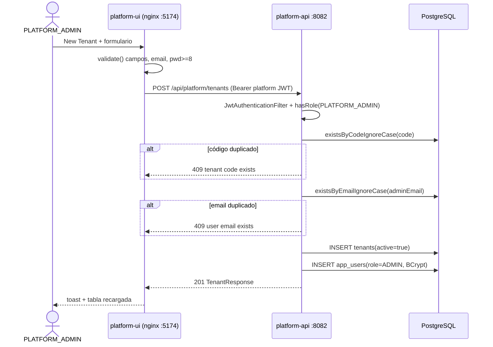
```mermaid
sequenceDiagram
  actor Op as PLATFORM_ADMIN
  participant PU as platform-ui (nginx :5174)
  participant PA as platform-api :8082
  participant DB as PostgreSQL
  Op->>PU: New Tenant + formulario
  PU->>PU: validate() campos, email, pwd>=8
  PU->>PA: POST /api/platform/tenants (Bearer platform JWT)
  PA->>PA: JwtAuthenticationFilter + hasRole(PLATFORM_ADMIN)
  PA->>DB: existsByCodeIgnoreCase(code)
  alt código duplicado
    PA-->>PU: 409 tenant code exists
  end
  PA->>DB: existsByEmailIgnoreCase(adminEmail)
  alt email duplicado
    PA-->>PU: 409 user email exists
  end
  PA->>DB: INSERT tenants(active=true)
  PA->>DB: INSERT app_users(role=ADMIN, BCrypt)
  PA-->>PU: 201 TenantResponse
  PU-->>Op: toast + tabla recargada
```

### P2. Activación y desactivación de un tenant (efecto real)

- **Disparador:** impago, baja o reactivación de un comercio.
- **Pasos UI:** Tenants → columna Actions → **"Deactivate"** (pide `window.confirm` con el texto *"Its users will no longer be able to operate in tenant-api."*) o **"Activate"** (sin confirmación) (`PU/modules/tenants/TenantsPage.tsx:124-152`).
- **Endpoints:** `PATCH /api/platform/tenants/{id}/deactivate` · `PATCH /api/platform/tenants/{id}/activate`.
- **Lógica:** solo cambia `tenants.active` y `updated_at` (`PA/tenant/service/TenantServiceImpl.java:86-104`) [V]. No toca usuarios, no revoca tokens, no emite eventos.
- **Efecto real verificado en el código del plano tenant [V]:**

| Pregunta | Respuesta | Evidencia |
|---|---|---|
| ¿El ADMIN/STAFF de un tenant inactivo puede hacer login? | **Sí.** `login()` valida credenciales, `user.active` y que el tenant no sea nulo, pero **nunca** `tenant.active`. | `BE/auth/service/AuthServiceImpl.java:42-68` |
| ¿Los JWT ya emitidos siguen siendo válidos? | **Sí**, hasta su expiración (24 h). El filtro solo compara `sub` y expiración. | `BE/auth/security/JwtService.java:43-46`, `JwtAuthenticationFilter.java:49-59` |
| ¿Las operaciones de negocio verifican el tenant activo? | **No.** `findAuthenticatedUser` solo verifica `tenant != null`. | p.ej. `BE/customer/service/CustomerServiceImpl.java:122-131` |
| ¿La UI de tenant muestra algo? | `AuthUserResponse.tenant.active` llega al front pero **no se usa** en ninguna pantalla. | `FE/auth/auth.types.ts:3-8`; grep sin usos |

- **Conclusión:** la desactivación es hoy **solo un indicador visual en platform-ui**. El mensaje de confirmación y el README (sección "Flujo de prueba") prometen un efecto que no existe. No se probó en vivo porque requiere una escritura.

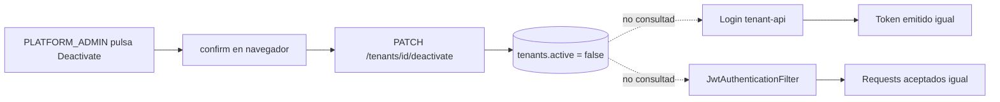
```mermaid
flowchart LR
  A[PLATFORM_ADMIN pulsa Deactivate] --> B[confirm en navegador]
  B --> C[PATCH /tenants/id/deactivate]
  C --> D[(tenants.active = false)]
  D -.no consultado.-> E[Login tenant-api]
  D -.no consultado.-> F[JwtAuthenticationFilter]
  E --> G[Token emitido igual]
  F --> H[Requests aceptados igual]
```

### P3. Login y sesión (ambos planos) y transporte del tenant_id

**Plano tenant** (`POST /api/auth/login`, `BE/auth/controller/AuthController.java:31-36`):
1. LoginPage (`FE/modules/auth/LoginPage.tsx`) → email + password → **"Sign in"**.
2. `AuthServiceImpl.login` normaliza email (trim + lower), autentica con `DaoAuthenticationProvider` + BCrypt (`BE/config/SecurityConfig.java:94-109`); errores → `BusinessException` → **400** "Invalid email or password." / "User account is inactive." [V][L].
3. Exige `user.active` y `tenant != null`; genera JWT HS512 con claims `role, tenantId, tenantCode, tenantName, sub=email, iat, exp` (exp = 86 400 000 ms = 24 h, `application-dev.properties:14`) [V][L — token decodificado].
4. Respuesta `{accessToken, tokenType:"Bearer", user:{id, firstName, lastName, email, role, active, tenant:{id,name,code,active}}}`.
5. El front guarda el token en `localStorage["sifipro-access-token"]` (`FE/auth/auth.service.ts:4,26-32`), lo pone en el header por defecto de Axios y navega a `/dashboard`.
6. Al recargar, `AuthContext` restaura con `GET /api/auth/me` (`FE/auth/AuthContext.tsx:92-115`); cualquier 401 limpia sesión y redirige a `/login` (`FE/lib/api-client.ts:17-28`).

**Cómo viaja realmente el tenant:** el claim `tenantId` viaja en el JWT, **pero el backend nunca lo lee** (solo `JwtService.generateToken` lo escribe; grep de `extractClaim`/`tenantId` fuera de `JwtService` sin resultados) [V]. En cada request, el filtro obtiene el `sub` (email), carga el usuario de BD, y cada servicio llama `findAuthenticatedUser(email).getTenant().getId()` para filtrar. Ventaja: un cambio de tenant/rol en BD se refleja al instante en el filtrado; desventaja: 1–2 consultas extra por request y el claim es decorativo.

**Plano plataforma** (`POST /api/platform/auth/login`, `PA/auth/controller/AuthController.java:27-31`):
- `CustomUserDetailsService` trata cualquier rol ≠ `PLATFORM_ADMIN` como "no encontrado" (`PA/auth/security/CustomUserDetailsService.java:30-32`); fallos → **401** uniforme "Invalid email or password, or insufficient privileges." (`PA/shared/exception/GlobalExceptionHandler.java:55-62`) [V][L].
- JWT HS512 con claims `role, sub, iat, exp` (sin tenant), 24 h, firmado con `PLATFORM_JWT_SECRET` distinto (`PA/auth/security/JwtService.java:25-35`) [V][L].
- Token en `localStorage["platform-access-token"]` (`PU/auth/auth.service.ts:6`).
- **Rechazo cruzado verificado en vivo:** token tenant en `/api/platform/auth/me` → 401; token plataforma en `/api/auth/me` → 401 [L].

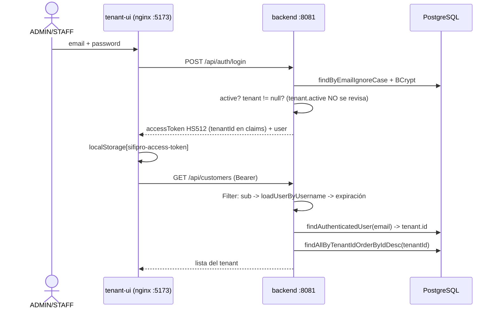
```mermaid
sequenceDiagram
  actor U as ADMIN/STAFF
  participant FE as tenant-ui (nginx :5173)
  participant BE as backend :8081
  participant DB as PostgreSQL
  U->>FE: email + password
  FE->>BE: POST /api/auth/login
  BE->>DB: findByEmailIgnoreCase + BCrypt
  BE->>BE: active? tenant != null? (tenant.active NO se revisa)
  BE-->>FE: accessToken HS512 (tenantId en claims) + user
  FE->>FE: localStorage[sifipro-access-token]
  FE->>BE: GET /api/customers (Bearer)
  BE->>BE: Filter: sub -> loadUserByUsername -> expiración
  BE->>DB: findAuthenticatedUser(email) -> tenant.id
  BE->>DB: findAllByTenantIdOrderByIdDesc(tenantId)
  BE-->>FE: lista del tenant
```

### P4. Gestión de usuarios internos

- **Disparador:** el ADMIN incorpora personal o cambia permisos.
- **Pasos UI:** menú **Users** (solo ADMIN, `FE/app/router/AppRouter.tsx:74-81`) → **"New User"** (modal `UserFormModal`: nombre, apellido, email, rol ADMIN/STAFF, contraseña) · por fila: **Edit**, **Activate/Deactivate**, **Change password** (`PasswordUpdateModal`).
- **Endpoints:** `GET/POST /api/users`, `GET/PUT /api/users/{id}`, `PATCH /api/users/{id}/activate|deactivate`, `PATCH /api/users/{id}/password` (204).
- **Reglas** (`BE/user/service/UserServiceImpl.java`) [V]:
  - Email único **global** en toda la plataforma (`:31-34`, `:76-79`; constraint `uk4vj92ux8a2eehds1mdvmks473`) → 400 "A user with this email already exists.".
  - Contraseña 8–100 al crear y al cambiar (`CreateUserRequest.java:30-32`, `UpdateUserPasswordRequest.java:11-13`); BCrypt.
  - El usuario nuevo hereda el tenant del ADMIN (`:45`); búsquedas por `findByIdAndTenantId` (`:130-133`).
  - **No valida el rol:** acepta `PLATFORM_ADMIN` (`:43`, `:84`). **No impide** auto-desactivarse o auto-degradarse.
  - Desactivar no invalida los JWT del usuario (ver P3).
- **Datos:** `app_users` (insert/update). Sin auditoría de quién hizo el cambio.
- **Resultado:** toasts de éxito/error; la tabla se recarga.

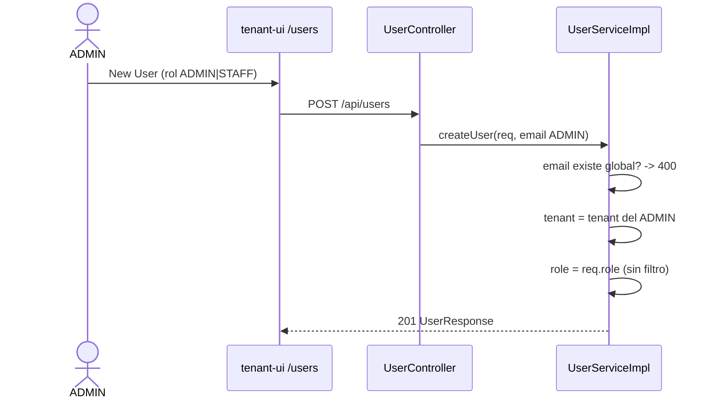
```mermaid
sequenceDiagram
  actor A as ADMIN
  participant FE as tenant-ui /users
  participant BE as UserController
  participant S as UserServiceImpl
  A->>FE: New User (rol ADMIN|STAFF)
  FE->>BE: POST /api/users
  BE->>S: createUser(req, email ADMIN)
  S->>S: email existe global? -> 400
  S->>S: tenant = tenant del ADMIN
  S->>S: role = req.role (sin filtro)
  S-->>FE: 201 UserResponse
```

### P5. Configuración del programa de lealtad

- **Disparador:** el ADMIN define o ajusta cómo se ganan puntos.
- **Pasos UI:** menú **Programs** (`/program-config`, solo ADMIN) → **"New Program"** / **Edit** / **Activate-Deactivate** / **Refresh** (`FE/modules/program-config/ProgramConfigPage.tsx`). El programa "actual" se elige en el **Dashboard** (selector "Program") y se guarda en `localStorage["sifipro-current-program-id"]` (`FE/modules/program-config/ProgramContext.tsx:25,50-64`).
- **Endpoints:** `GET/POST /api/program-config`, `GET/PUT /api/program-config/{id}`, `PATCH …/{id}/activate|deactivate`.
- **Parámetros** (`BE/loyalty/entity/ProgramConfig.java:17-31`):

| Parámetro | Tipo / precisión | Validación | Efecto en el cálculo |
|---|---|---|---|
| `programName` | varchar(100) | obligatorio, ≤100, único por tenant sin mayúsculas | ninguno (identificación) |
| `pointsPerDollar` | numeric(12,4) | `@NotNull @Positive` | multiplicador del monto |
| `minimumPurchaseAmount` | numeric(12,2) | `@NotNull @DecimalMin(0.0)` | por debajo → 0 puntos |
| `active` | boolean | `@NotNull` (se elige al crear) | programa inactivo → no se registran compras en él (400 "Program is inactive.") |

- **Reglas:** nombre duplicado en el tenant → 400 "A program with this name already exists in this tenant." (`ProgramConfigServiceImpl.java:38-40,79-82`) + índice `uk_program_config_tenant_program_name_lower` [V][L].
- **Notas:** un tenant puede tener **varios programas**; recompensas, transacciones, canjes y movimientos pertenecen a un programa. Cambiar `pointsPerDollar` **no recalcula** compras pasadas (los puntos se guardan en `points_earned`). No valida que un programa inactivo no tenga recompensas canjeables (ver RN-24).

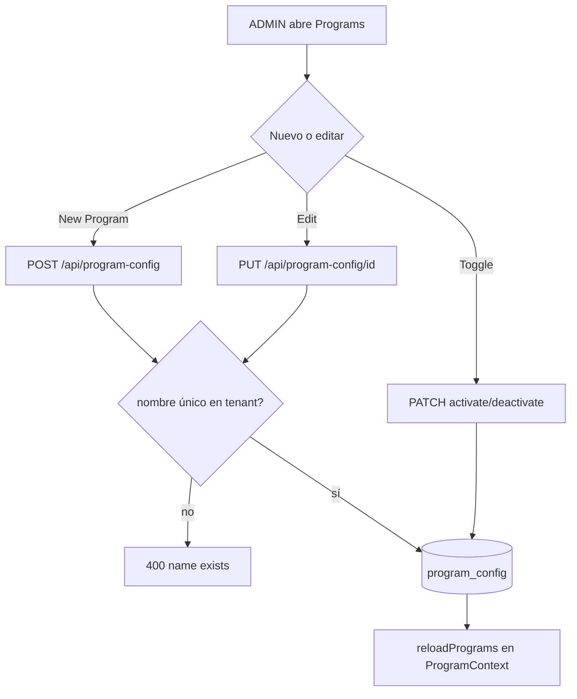
```mermaid
flowchart TD
  A[ADMIN abre Programs] --> B{Nuevo o editar}
  B -->|New Program| C[POST /api/program-config]
  B -->|Edit| D[PUT /api/program-config/id]
  B -->|Toggle| E[PATCH activate/deactivate]
  C & D --> F{nombre único en tenant?}
  F -->|no| G[400 name exists]
  F -->|sí| H[(program_config)]
  E --> H
  H --> I[reloadPrograms en ProgramContext]
```

### P6. Registro de clientes

- **Disparador:** un comprador se inscribe en el programa.
- **Pasos UI:** menú **Customers** → **"New Customer"** (modal: First name, Last name, Email, Phone) → guardar. Por fila: **Edit**, **Activate/Deactivate** (ADMIN) y enlace al **perfil** `/customers/:id` (`FE/modules/customers/components/CustomersTable.tsx:60-100`).
- **Endpoints:** `POST /api/customers` (ADMIN, STAFF) · `PUT /api/customers/{id}` y `PATCH …/activate|deactivate` (solo ADMIN) · `GET /api/customers`, `/{id}`, `/{id}/profile`, `/{id}/points-history`.
- **Reglas** (`BE/customer/service/CustomerServiceImpl.java:31-115`) [V]: nombres obligatorios ≤100; email obligatorio válido ≤150, normalizado a minúsculas; teléfono opcional ≤30 (vacío → null); email único **en el tenant** → 400 "A customer with this email already exists in this tenant."; saldo inicial 0, `active=true`, tenant del usuario.
- **Contradicción de BD:** existe además `UNIQUE(email)` **global** en `customers` (`MIG/V1__baseline_schema.sql:386-387`, confirmado en la BD viva [L]). Si dos comercios registran al mismo cliente, el segundo recibe **409** "Operation violates database integrity constraints." con el detalle SQL (`BE/shared/exception/GlobalExceptionHandler.java:71-83`) [I].
- **Resultado:** cliente visible en la tabla, tier BRONZE, progreso 0%.

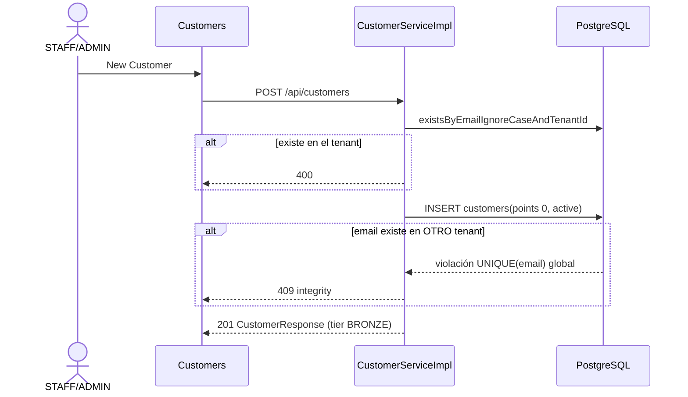
```mermaid
sequenceDiagram
  actor S as STAFF/ADMIN
  participant FE as Customers
  participant BE as CustomerServiceImpl
  participant DB as PostgreSQL
  S->>FE: New Customer
  FE->>BE: POST /api/customers
  BE->>DB: existsByEmailIgnoreCaseAndTenantId
  alt existe en el tenant
    BE-->>FE: 400
  end
  BE->>DB: INSERT customers(points 0, active)
  alt email existe en OTRO tenant
    DB-->>BE: violación UNIQUE(email) global
    BE-->>FE: 409 integrity
  end
  BE-->>FE: 201 CustomerResponse (tier BRONZE)
```

### P7. Registro de una transacción y acumulación de puntos

- **Disparador:** un cliente realiza una compra.
- **Pasos UI:** menú **Transactions** (requiere programa seleccionado) → **"New Transaction"** → modal con Customer (lista de clientes del tenant, **incluye inactivos**), Amount (>0), Description, Transaction date (fecha, se envía como `YYYY-MM-DDT00:00:00`, `FE/lib/date-utils.ts:9-28`) → guardar. Toast: "Transaction created. Awarded points: N." (`FE/modules/transactions/TransactionsPage.tsx:196-227`).
- **Endpoint:** `POST /api/transactions` con `{customerId, programConfigId, amount, description?, transactionDate}`.
- **Reglas** (`BE/transaction/service/PurchaseTransactionServiceImpl.java:50-109, 214-220`) [V]:
  1. Cliente del tenant (si no → 404), **activo** (si no → 400 "Customer is inactive.").
  2. Programa del tenant (404), **activo** (400 "Program is inactive.").
  3. `amount` `@Positive`; `transactionDate` obligatoria pero **sin validación de rango** (puede ser futura).
- **Fórmula exacta:**

```
montoNormalizado = amount.setScale(2, HALF_UP)
si montoNormalizado < minimumPurchaseAmount  → puntos = 0.0000
si no                                         → puntos = (montoNormalizado × pointsPerDollar).setScale(4, HALF_UP)
```

- **Ejemplos** con el programa demo (`pointsPerDollar=1.5000`, `minimumPurchaseAmount=25.00`):

| Monto enviado | Normalizado | ¿≥ mínimo? | Puntos |
|---|---|---|---|
| 200.00 | 200.00 | sí | 300.0000 *(dato real, transacción #1 [L])* |
| 80.00 | 80.00 | sí | 120.0000 *(#2 [L])* |
| 18.00 | 18.00 | no | 0.0000 *(#5 [L])* |
| 25.00 | 25.00 | sí (comparación estricta `<`) | 37.5000 |
| 80.555 | 80.56 | sí | 120.8400 |
| 24.995 | 25.00 | sí (se redondea antes de comparar) | 37.5000 |

- **Datos:** siempre se inserta `purchase_transactions` (con `points_earned`, `created_by`); **solo si puntos > 0** se incrementa `customers.points_balance` (4 decimales) y se inserta un `points_movements` tipo `EARN`, `reference_type='PURCHASE_TRANSACTION'`, `reference_id` = id de la compra. Todo en una transacción.
- **Resultado:** la compra aparece en la tabla y el movimiento en "Points movements" del programa.

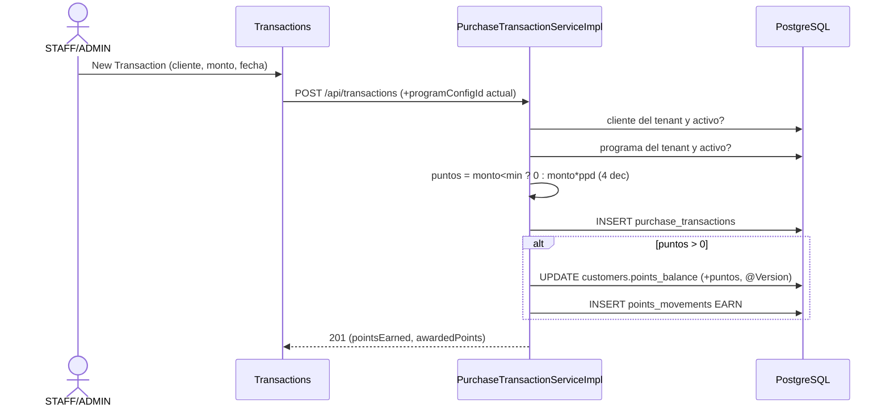
```mermaid
sequenceDiagram
  actor S as STAFF/ADMIN
  participant FE as Transactions
  participant BE as PurchaseTransactionServiceImpl
  participant DB as PostgreSQL
  S->>FE: New Transaction (cliente, monto, fecha)
  FE->>BE: POST /api/transactions (+programConfigId actual)
  BE->>DB: cliente del tenant y activo?
  BE->>DB: programa del tenant y activo?
  BE->>BE: puntos = monto<min ? 0 : monto*ppd (4 dec)
  BE->>DB: INSERT purchase_transactions
  alt puntos > 0
    BE->>DB: UPDATE customers.points_balance (+puntos, @Version)
    BE->>DB: INSERT points_movements EARN
  end
  BE-->>FE: 201 (pointsEarned, awardedPoints)
```

### P8. Catálogo de recompensas: stock y activación

- **Disparador:** el ADMIN publica o ajusta premios.
- **Pasos UI:** menú **Rewards** (tarjetas por programa actual, `FE/modules/rewards/RewardsPage.tsx`) → **"New Reward"** / **"Add First Reward"** → modal (Name, Description, Required points, Stock) · por tarjeta **Edit** y **Activate/Deactivate**. Barra con contadores "N active · N low stock (≤5) · N out of stock".
- **Endpoints:** `POST /api/rewards`, `PUT /api/rewards/{id}`, `PATCH …/activate|deactivate` (solo ADMIN); `GET /api/rewards`, `/programs/{programConfigId}`, `/{id}` (ADMIN, STAFF).
- **Reglas** (`BE/reward/service/RewardServiceImpl.java:35-141`) [V]: nombre obligatorio ≤120, único **por programa** (400 "A reward with this name already exists in this program." + `uk_rewards_program_name_lower`); `requiredPoints > 0`; `stock ≥ 0` (DTO + `validateStock`); `programConfigId` del tenant (404); se crea siempre `active=true`; al editar puede **cambiar de programa**; `imageUrl` opcional ≤500.
- **Stock:** se fija manualmente al crear/editar (reposición = editar stock) y baja en 1 por canje. **Al llegar a 0 la recompensa sigue activa**; el canje la rechaza por "out of stock".
- **Defecto:** la UI no tiene campo de imagen y **no envía `imageUrl`**; como `updateReward` asigna `normalizeImageUrl(null)` (`RewardServiceImpl.java:115`), **editar desde la UI borra la imagen** [V].

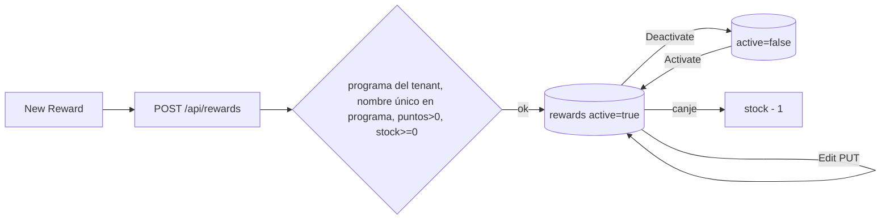
```mermaid
flowchart LR
  N[New Reward] --> C[POST /api/rewards]
  C --> V{programa del tenant, nombre único en programa, puntos>0, stock>=0}
  V -->|ok| R[(rewards active=true)]
  R -->|Edit PUT| R
  R -->|Deactivate| I[(active=false)]
  I -->|Activate| R
  R -->|canje| S[stock - 1]
```

### P9. Canje de recompensas

- **Disparador:** el cliente pide cambiar puntos por un premio.
- **Pasos UI:** menú **Redemptions** → **"New Redemption"** → modal: Customer (todos los del tenant), Reward (recompensas **activas** del programa actual; si no hay activas, muestra todas — `FE/modules/redemptions/components/RedemptionFormModal.tsx:70-74`), panel informativo (programa, puntos requeridos, stock, activa), Redemption date, Notes → guardar. Luego la tabla y el panel "historial del cliente" se refrescan (`RedemptionsPage.tsx:394-445`).
- **Endpoint:** `POST /api/redemptions` `{customerId, rewardId, redemptionDate, notes?}` (notas ≤300).
- **Validaciones** (`BE/redemption/service/RedemptionServiceImpl.java:52-102, 138-180`) [V], en orden:
  1. Cliente del tenant → si no 404; recompensa del tenant → si no 404.
  2. Cliente activo → 400 "Customer is inactive.".
  3. Recompensa activa → 400 "Reward is inactive.".
  4. `stock > 0` → 400 "Reward is out of stock.".
  5. **Saldo por programa:** suma del ledger del cliente **en el programa de la recompensa** (EARN/ADJUSTMENT suman, REDEEM/EXPIRE restan su valor absoluto) ≥ `requiredPoints` → si no 400 "Insufficient points for this program.".
  - **No** valida que el programa esté activo; **no** valida la fecha.
- **Efectos (una sola transacción):** `INSERT redemptions` (estado `COMPLETED`, `points_used`, `created_by`) → `customers.points_balance -= requiredPoints` → `rewards.stock -= 1` → `INSERT points_movements` tipo `REDEEM` con puntos **negativos**, `reference_type='REDEMPTION'`.
- **Bloqueo optimista:** `Customer` y `Reward` tienen `@Version` (`BE/customer/entity/Customer.java:18-19`, `BE/reward/entity/Reward.java:19-20`). Dos canjes simultáneos sobre el mismo stock/cliente → uno falla con `OptimisticLockingFailureException` → **409** "La operación no se pudo completar, intenta de nuevo." (`GlobalExceptionHandler.java:61-69`). Cubierto por `RedemptionConcurrencyIntegrationTest` [V].
- **Estados:** solo `COMPLETED`. `CANCELLED` existe en el enum y en el CHECK de BD pero **no hay endpoint, servicio ni UI** para cancelar o revertir (ni devolución de puntos ni de stock).
- **Dato real [L]:** canje demo de "15% Descuento en tienda" (120 pts) por Laura Mendoza: saldo 420 → 300, stock 20 → 19, `rewards.version = 1`.

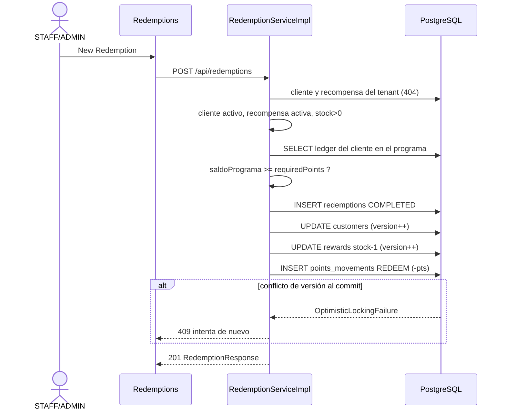
```mermaid
sequenceDiagram
  actor S as STAFF/ADMIN
  participant FE as Redemptions
  participant BE as RedemptionServiceImpl
  participant DB as PostgreSQL
  S->>FE: New Redemption
  FE->>BE: POST /api/redemptions
  BE->>DB: cliente y recompensa del tenant (404)
  BE->>BE: cliente activo, recompensa activa, stock>0
  BE->>DB: SELECT ledger del cliente en el programa
  BE->>BE: saldoPrograma >= requiredPoints ?
  BE->>DB: INSERT redemptions COMPLETED
  BE->>DB: UPDATE customers (version++)
  BE->>DB: UPDATE rewards stock-1 (version++)
  BE->>DB: INSERT points_movements REDEEM (-pts)
  alt conflicto de versión al commit
    DB-->>BE: OptimisticLockingFailure
    BE-->>FE: 409 intenta de nuevo
  end
  BE-->>FE: 201 RedemptionResponse
```

### P10. Cálculo de tiers (Bronze / Silver / Gold)

- **Implementación:** `BE/customer/CustomerTier.java:6-55` [V]; se calcula al vuelo en cada respuesta de cliente (`CustomerServiceImpl.java:145-150`, `CustomerProfileServiceImpl.java:88-101`); **no se guarda** en BD.
- **Base del cálculo:** `points_balance` **actual** (saldo global de todos los programas), **no** puntos históricos. Un canje puede bajar de nivel al cliente.

| Tier | Condición | Siguiente umbral |
|---|---|---|
| BRONZE | saldo < 500 (o nulo) | 500 |
| SILVER | 500 ≤ saldo < 2000 | 2000 |
| GOLD | saldo ≥ 2000 | — (progreso 100 %) |

- **Progreso:** `((saldo − umbralActual) / (umbralSiguiente − umbralActual)).setScale(6,HALF_UP) × 100 → setScale(2,HALF_UP)`; `pointsToNextTier = max(0, siguiente − saldo)`.
- **Ejemplo:** saldo 750 → SILVER, progreso (750−500)/(2000−500) = 16.67 %, faltan 1 250. Saldo 300 → BRONZE, 60.00 %, faltan 200.
- **Limitación:** umbrales hardcodeados, iguales para todos los tenants y programas.

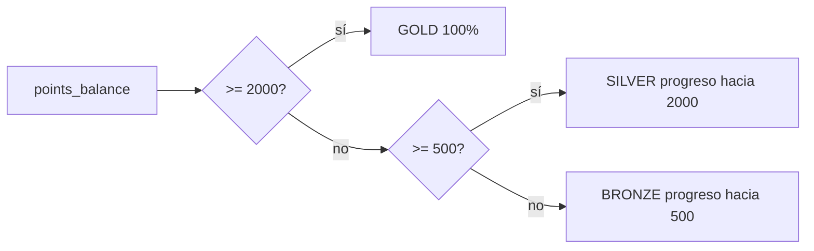
```mermaid
flowchart LR
  P[points_balance] --> Q{>= 2000?}
  Q -->|sí| G[GOLD 100%]
  Q -->|no| R{>= 500?}
  R -->|sí| S[SILVER progreso hacia 2000]
  R -->|no| B[BRONZE progreso hacia 500]
```

### P11. Ledger de movimientos de puntos (`points_movements`)

- **Tipos** (`BE/transaction/entity/PointsMovementType.java:3-8`, CHECK en BD): `EARN`, `REDEEM`, `ADJUSTMENT`, `EXPIRE`. **Solo EARN y REDEEM se generan** (BD viva: 4 EARN/PURCHASE_TRANSACTION, 1 REDEEM/REDEMPTION [L]); `ADJUSTMENT` y `EXPIRE` son valores reservados sin flujo.
- **Convención de signo:** EARN positivo; REDEEM se guarda negativo; los lectores igual aplican `abs().negate()` a REDEEM/EXPIRE (`RedemptionServiceImpl.java:171-173`, `CustomerProfileServiceImpl.java:181-186`) — robusto a ambos signos.
- **Trazabilidad:** `reference_type` + `reference_id` apuntan a la compra o canje de origen; `created_by` = id del usuario interno; `program_config_id` y `tenant_id` obligatorios.
- **¿Es inmutable?** Solo **por convención de la aplicación**: no hay endpoint de edición/borrado y el servicio solo inserta. **No es inmutable a nivel BD:** no hay triggers (consulta a `pg_trigger` vacía [L]), no hay permisos restringidos, la entidad hereda `updated_at` con `@LastModifiedDate`, y el propio test de integración borra filas del ledger (`RedemptionConcurrencyIntegrationTest.java:87-88`). El README lo llama "ledger inmutable" [R].
- **Consistencia:** en la BD viva `points_balance` = suma del ledger para los 3 clientes (diferencia 0.0000) [L]. No hay proceso que reconcilie ambos si divergieran.
- **Consultas disponibles:** por tenant, por programa, por cliente (`GET /api/transactions/points-movements`, `/program/{id}/points-movements`, `/customer/{id}/points-movements`) y el historial acumulado para gráfica (`GET /api/customers/{id}/points-history`, con `runningBalance` cronológico — suma todos los programas).

### P12. Perfil 360° del cliente

- **Pantalla:** `/customers/:id` (`FE/modules/customers/CustomerProfilePage.tsx`): encabezado (nombre, contacto, tier, barra de progreso), 4 tarjetas de estadísticas, gráfica de área del saldo acumulado (Recharts) y feed de actividad reciente.
- **Endpoints:** `GET /api/customers/{id}/profile` y `GET /api/customers/{id}/points-history` (si este último falla, la gráfica queda vacía sin error, `:113-115`).
- **Contenido** (`BE/customer/service/CustomerProfileServiceImpl.java:55-200`): miembro desde (`created_at`), saldo, tier y progreso, total de transacciones y canjes, puntos ganados/canjeados de por vida, últimas **5** compras y últimos **3** canjes.

### P13. Dashboard operativo

- **Pantalla:** `/dashboard` (`FE/modules/dashboard/DashboardPage.tsx`), vista por defecto tras login. Muestra tenant, **selector de programa** (único lugar de la app donde se cambia el programa actual), rol, 5 métricas (clientes, clientes activos, recompensas del programa, transacciones del programa, canjes del programa), gráfica de actividad, últimas 5 transacciones y canjes, recompensas con **stock bajo (≤5)** y accesos rápidos según rol (`DashboardQuickActions.tsx:17-78`).
- **Datos:** 4 llamadas en paralelo (`GET /api/customers`, `/api/transactions/program/{id}`, `/api/redemptions` —todas, filtradas por programa en el navegador—, `/api/rewards/programs/{id}`) y agregación en el cliente (`FE/modules/dashboard/dashboard.service.ts:51-105`).

### P14. Reportes

- **Pantalla:** `/reports` (`FE/modules/reports/ReportsPage.tsx`): 8 métricas (incluye puntos emitidos y canjeados en el programa), top 10 clientes por actividad en el programa y top 10 recompensas más canjeadas, botón **Refresh** con "Last updated".
- **Datos:** mismas 4 llamadas que el dashboard y cálculo en el cliente (`FE/modules/reports/reports.service.ts:155-188`). No hay filtros de fechas, exportación ni endpoints de reportes: los antiguos `/api/reports/*` se eliminaron en el commit `47b9cc3` porque devolvían datos de todos los tenants.

### P15. Otros procesos encontrados

| Proceso | Dónde | Estado |
|---|---|---|
| Sembrado de datos demo (perfil `dev`) | `BE/config/DevDataSeederConfig.java:38-135`: crea PLATFORM_ADMIN si falta; si no hay usuarios con tenant, crea tenant `demo`, ADMIN y STAFF; si la BD de negocio está vacía, crea 1 programa, 3 clientes, 3 recompensas, 5 compras y 1 canje. | ✅ Funciona [L] |
| Cambio de contraseña por ADMIN | `PATCH /api/users/{id}/password` + `PasswordUpdateModal` | ✅ (sin auto-servicio "cambiar mi contraseña" ni recuperación) |
| Selector de programa persistente | `ProgramContext` + `localStorage` | ✅ |
| Tema claro/oscuro | `FE/lib/theme.ts` (`localStorage["sifipro-theme"]`) | ✅ |
| Health checks | `GET /api/health`, `GET /api/platform/health`, `/actuator/health` | ✅ [L] |
| Búsqueda / filtros / paginación en listas | — | ❌ No existen en tenant-ui; platform-api pagina (tamaño 20 por defecto) pero la UI pide `size=100` sin controles |

## A4. Catálogo de reglas de negocio

| ID | Regla | Dónde se implementa | Si se viola |
|---|---|---|---|
| RN-01 | Solo PLATFORM_ADMIN opera el plano de plataforma. | `PA/config/SecurityConfig.java:59-60`; `CustomUserDetailsService.java:30-32` | 401 (login) / 403 (endpoint) |
| RN-02 | El código de tenant es único (sin distinguir mayúsculas) y se guarda en minúsculas. | `TenantServiceImpl.java:39-42,126-128`; `uk_tenants_code` | 409 "A tenant with this code already exists." |
| RN-03 | Al crear un tenant se crea su primer ADMIN en la misma transacción. | `TenantServiceImpl.java:36-72` | rollback total |
| RN-04 | El email de un usuario interno es único en toda la plataforma. | `UserServiceImpl.java:31-34,76-79`; `TenantServiceImpl.java:44-47`; `uk4vj92…` | 400 (tenant) / 409 (plataforma) |
| RN-05 | Contraseñas de 8 a 100 caracteres, almacenadas con BCrypt. | DTOs `CreateUserRequest`, `UpdateUserPasswordRequest`, `CreateTenantRequest`; `BCryptPasswordEncoder` | 400 "Validation failed" |
| RN-06 | Solo usuarios activos pueden iniciar sesión. | `CustomUserDetailsService.disabled(...)`; `AuthServiceImpl.java:59-61` | 400 "User account is inactive." (tenant) / 401 (plataforma) |
| RN-07 | Solo usuarios con tenant pueden iniciar sesión en el plano tenant. | `AuthServiceImpl.java:62-64`; `JwtService.java:27-29` | 400 "User account is not associated with a tenant." |
| RN-08 | Un token de un plano no es válido en el otro (secretos distintos). | `JwtService` de cada servicio; `.env.example:131-139` | 401 [L] |
| RN-09 | Toda operación de negocio se limita al tenant del usuario autenticado. | `findBy…AndTenantId` en los 7 servicios (B5) | 404 "X not found with id" |
| RN-10 | STAFF solo lee y crea clientes, transacciones y canjes; ADMIN todo. | `BE/config/SecurityConfig.java:63-88` | 403 |
| RN-11 | El usuario interno creado pertenece al tenant del ADMIN que lo crea. | `UserServiceImpl.java:45` | — |
| RN-12 | Nombre de programa único por tenant (sin mayúsculas). | `ProgramConfigServiceImpl.java:38-40,79-82`; índice `uk_program_config_tenant_program_name_lower` | 400 "A program with this name already exists in this tenant." |
| RN-13 | `pointsPerDollar` > 0. | `CreateProgramConfigRequest.java:20-22` | 400 |
| RN-14 | `minimumPurchaseAmount` ≥ 0. | idem `:25-27` | 400 |
| RN-15 | Email de cliente único por tenant (normalizado a minúsculas). | `CustomerServiceImpl.java:37-40,80-84`; índice `uk_customers_tenant_email_lower` | 400 "A customer with this email already exists in this tenant." |
| RN-15b | *(Heredada, contradictoria)* email de cliente único **global**. | `MIG/V1:386-387` `ukrfbvkrffamfql7cjmen8v976v` | 409 "Operation violates database integrity constraints." |
| RN-16 | Cliente nuevo inicia con saldo 0 y activo. | `CustomerServiceImpl.java:47-48` | — |
| RN-17 | Solo clientes activos pueden acumular puntos. | `PurchaseTransactionServiceImpl.java:59-61` | 400 "Customer is inactive." |
| RN-18 | Solo programas activos aceptan compras. | idem `:64-66` | 400 "Program is inactive." |
| RN-19 | Monto de compra > 0; se redondea a 2 decimales HALF_UP. | `CreatePurchaseTransactionRequest.java:22-24`; `:68` | 400 |
| RN-20 | Compras bajo el mínimo del programa generan 0 puntos (la compra igual se registra). | `:214-218` | — |
| RN-21 | Puntos = monto × puntos por dólar, 4 decimales HALF_UP. | `:219` | — |
| RN-22 | Toda acumulación > 0 genera un movimiento EARN que referencia la compra. | `:88-106` | — |
| RN-23 | Nombre de recompensa único dentro de su programa. | `RewardServiceImpl.java:43-45,104-107`; índice `uk_rewards_program_name_lower` | 400 "A reward with this name already exists in this program." |
| RN-24 | Recompensa requiere puntos > 0 y stock ≥ 0; se crea activa. | `CreateRewardRequest.java:24-31`; `RewardServiceImpl.java:53,196-200` | 400 |
| RN-25 | Solo clientes activos pueden canjear. | `RedemptionServiceImpl.java:139-141` | 400 "Customer is inactive." |
| RN-26 | Solo recompensas activas se canjean. | `:143-145` | 400 "Reward is inactive." |
| RN-27 | No se canjea sin stock. | `:147-149` | 400 "Reward is out of stock." |
| RN-28 | El saldo **del programa de la recompensa** (según ledger) debe cubrir los puntos requeridos. | `:151-157,160-180` | 400 "Insufficient points for this program." |
| RN-29 | Un canje descuenta puntos del saldo, 1 unidad de stock y crea movimiento REDEEM negativo, atómicamente. | `:79-99` | rollback |
| RN-30 | Operaciones concurrentes sobre el mismo cliente/recompensa se serializan por versión. | `@Version` en `Customer`, `Reward` | 409 "La operación no se pudo completar, intenta de nuevo." |
| RN-31 | Todo canje nace `COMPLETED`. | `:75` | — |
| RN-32 | Tier por saldo actual: <500 Bronze, ≥500 Silver, ≥2000 Gold. | `CustomerTier.java:11-19` | — |
| RN-33 | Las compras, canjes y movimientos registran el usuario interno que los creó (`created_by`). | commit `aba35ac`; `:84`, `:77`, `:98`, `:104` | — |
| RN-34 | Notas/descripciones vacías se guardan como null (≤300). | `normalizeNotes`, `normalizeDescription` | 400 si >300 |
| RN-35 | Rechazo uniforme de logins de plataforma (no distingue contraseña errónea de rol incorrecto). | `PA/.../GlobalExceptionHandler.java:48-62` | 401 genérico |
| RN-36 | Los errores se devuelven con formato `ApiErrorResponse {timestamp,status,error,message,details}`. | `ApiErrorResponse.java` (ambos servicios) | — |
| RN-37 | Datos de programa/recompensa/transacción/canje no se eliminan (no existe DELETE). | controladores | — |

**Reglas que un evaluador esperaría y NO existen** (se listan en D2): expiración de puntos, ajuste manual, cancelación/reversa de canje o compra, fecha de compra/canje no futura, bloqueo por tenant inactivo, límite de canjes, validación de programa activo en canje, restricción de rol al crear usuarios.

## A5. Estados y ciclos de vida

### Tenant
Estados: `active=true` / `active=false` (`tenants.active`, default true). Transiciones solo desde platform-api. **Sin efecto sobre el plano tenant** (P2).

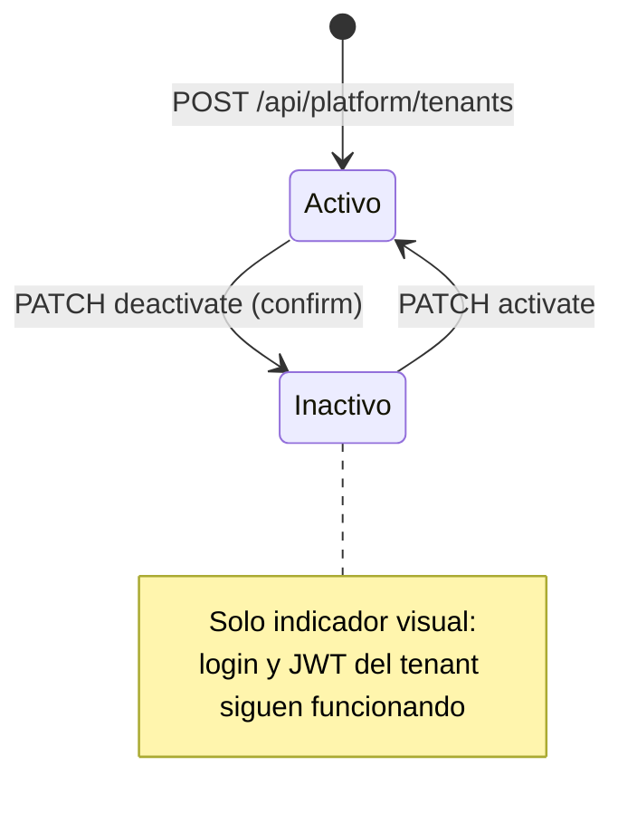
```mermaid
stateDiagram-v2
  [*] --> Activo: POST /api/platform/tenants
  Activo --> Inactivo: PATCH deactivate (confirm)
  Inactivo --> Activo: PATCH activate
  note right of Inactivo
    Solo indicador visual:
    login y JWT del tenant siguen funcionando
  end note
```

### Usuario interno (AppUser)
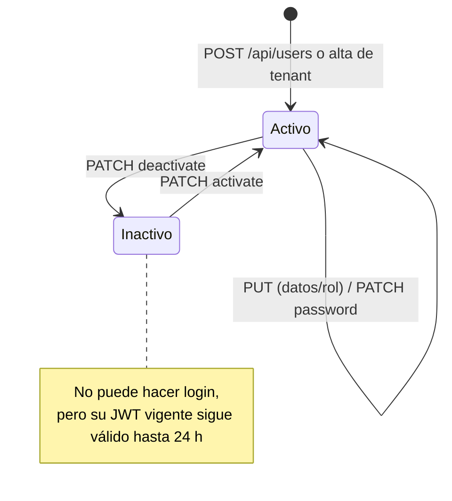
```mermaid
stateDiagram-v2
  [*] --> Activo: POST /api/users o alta de tenant
  Activo --> Inactivo: PATCH deactivate
  Inactivo --> Activo: PATCH activate
  Activo --> Activo: PUT (datos/rol) / PATCH password
  note right of Inactivo
    No puede hacer login,
    pero su JWT vigente sigue válido hasta 24 h
  end note
```

### Cliente
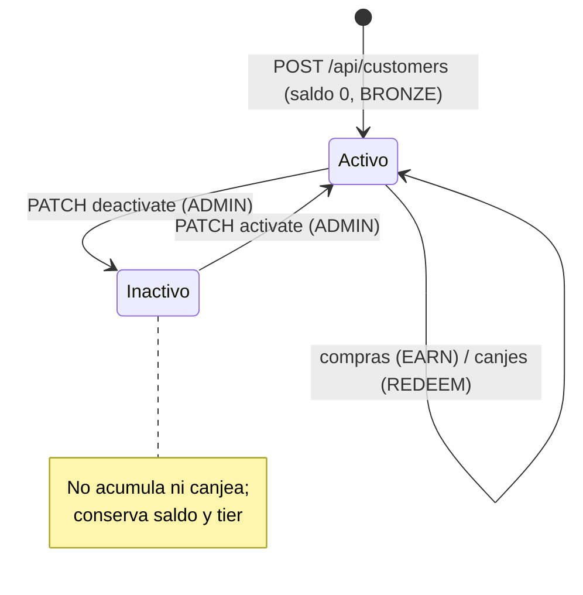
```mermaid
stateDiagram-v2
  [*] --> Activo: POST /api/customers (saldo 0, BRONZE)
  Activo --> Inactivo: PATCH deactivate (ADMIN)
  Inactivo --> Activo: PATCH activate (ADMIN)
  Activo --> Activo: compras (EARN) / canjes (REDEEM)
  note right of Inactivo
    No acumula ni canjea;
    conserva saldo y tier
  end note
```
Subestado derivado **Tier**: BRONZE ⇄ SILVER ⇄ GOLD según saldo (puede bajar tras canjear).

### Programa de lealtad
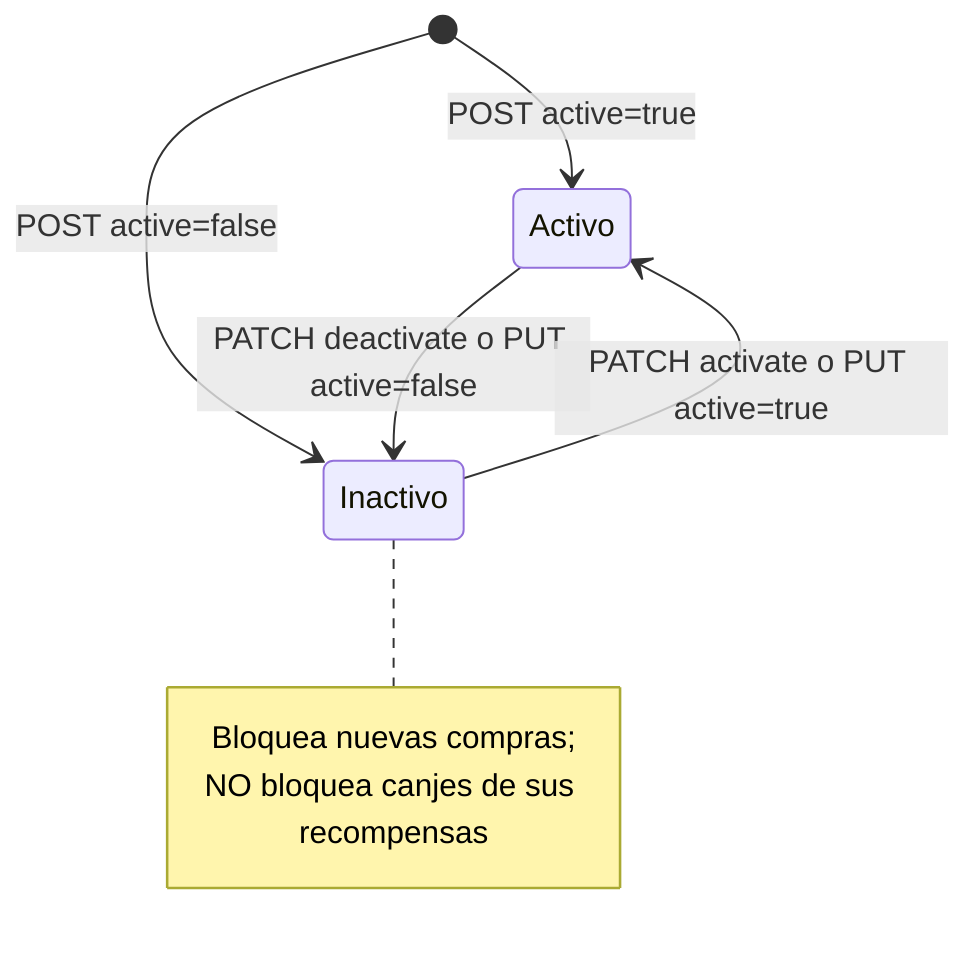
```mermaid
stateDiagram-v2
  [*] --> Activo: POST active=true
  [*] --> Inactivo: POST active=false
  Activo --> Inactivo: PATCH deactivate o PUT active=false
  Inactivo --> Activo: PATCH activate o PUT active=true
  note right of Inactivo
    Bloquea nuevas compras;
    NO bloquea canjes de sus recompensas
  end note
```

### Recompensa
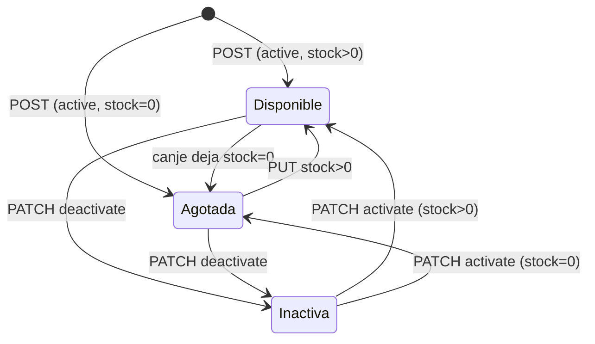
```mermaid
stateDiagram-v2
  [*] --> Disponible: POST (active, stock>0)
  [*] --> Agotada: POST (active, stock=0)
  Disponible --> Agotada: canje deja stock=0
  Agotada --> Disponible: PUT stock>0
  Disponible --> Inactiva: PATCH deactivate
  Agotada --> Inactiva: PATCH deactivate
  Inactiva --> Disponible: PATCH activate (stock>0)
  Inactiva --> Agotada: PATCH activate (stock=0)
```
"Agotada" no es un campo: es `active=true ∧ stock=0` (la UI la resalta como *out of stock*).

### Canje (Redemption)
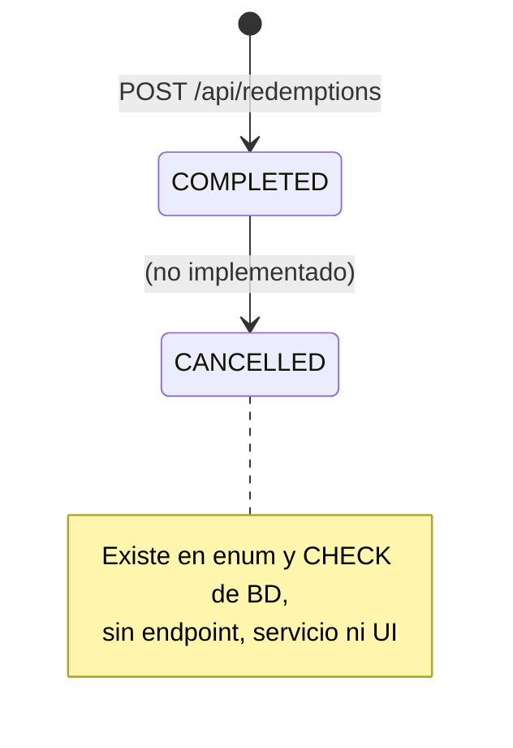
```mermaid
stateDiagram-v2
  [*] --> COMPLETED: POST /api/redemptions
  COMPLETED --> CANCELLED: (no implementado)
  note right of CANCELLED
    Existe en enum y CHECK de BD,
    sin endpoint, servicio ni UI
  end note
```

### Transacción de compra y movimiento de puntos
Sin estados: se crean y quedan fijos (no hay edición ni anulación).

## A6. Inventario de pantallas

### tenant-ui (`sifipro-frontend`, http://localhost:5173)

Todas las páginas protegidas comparten layout (Sidebar + Header con nombre, rol · tenant, toggle de tema y **Logout**) y usan toasts (Sonner). "Programa requerido" significa que sin programa seleccionado muestran el estado *"No program selected — Select a program from the header…"* (texto engañoso: el selector está en el Dashboard).

| Ruta | Propósito | Rol | Acciones | Carga | Vacío | Error |
|---|---|---|---|---|---|---|
| `/login` | Autenticación | público (redirige si ya hay sesión) | Sign in, toggle tema | botón "Signing in…" | — | caja "Sign-in failed" + mensaje |
| `/` | redirige a `/dashboard` | ADMIN, STAFF | — | "Restoring secure session..." | — | — |
| `/dashboard` | Resumen operativo por programa | ADMIN, STAFF | cambiar programa, accesos rápidos (distintos por rol) | skeleton | "No program selected" | tarjeta de error + Retry |
| `/customers` | Gestión de clientes | ADMIN, STAFF | New Customer; Edit, Activate/Deactivate (**visibles para STAFF, 403**); ver perfil | skeleton | "No customers yet" | "Failed to load customers" + Retry |
| `/customers/:id` | Perfil 360° | ADMIN, STAFF | volver, Retry | skeleton completo | gráfica/feeds vacíos | "Failed to load customer profile" + Retry/Back |
| `/rewards` | Catálogo por programa (tarjetas) | ADMIN, STAFF | New Reward, Add First Reward, Edit, Activate/Deactivate (**visibles para STAFF, 403**) | skeleton de tarjetas | "No rewards yet" + botón | "Failed to load rewards" + Retry |
| `/transactions` | Compras + movimientos del programa | ADMIN, STAFF | New Transaction | skeleton | "No transactions yet" | "Failed to load transactions" + Retry |
| `/redemptions` | Canjes + historial del cliente seleccionado | ADMIN, STAFF | New Redemption, seleccionar fila | skeleton | "No redemptions yet" | "Failed to load redemptions" + Retry; error de historial con Retry |
| `/reports` | Métricas y rankings del programa | ADMIN, STAFF | Refresh | skeleton | tablas vacías | "Failed to load reports" + Retry; alerta inline si falla el refresh |
| `/users` | Usuarios internos | ADMIN (ruta protegida, `AppRouter.tsx:74-81`) | New User, Edit, Activate/Deactivate, Change password | skeleton | "No internal users yet" | "Failed to load users" + Retry |
| `/program-config` | Programas de lealtad | ADMIN (`AppRouter.tsx:82-89`) | New Program, Refresh, Edit, Activate/Deactivate | skeleton | tabla vacía (sin mensaje dedicado) | "Failed to load programs" + Retry |
| `*` | 404 interno | autenticado | Back to Dashboard | — | — | "Page not found" |

STAFF que teclea `/users` o `/program-config` es redirigido a `/dashboard` (`FE/auth/ProtectedRoute.tsx:36-38`).

### platform-ui (`sifipro-platform-ui`, http://localhost:5174)

| Ruta | Propósito | Rol | Acciones | Carga | Vacío | Error |
|---|---|---|---|---|---|---|
| `/login` | Login de operador | público | Sign in, tema | "Signing in…" | — | "Sign-in failed" |
| `/`, `/dashboard` | redirigen a `/tenants` | PLATFORM_ADMIN | — | "Restoring secure session..." | — | — |
| `/tenants` | Alta y estado de tenants | PLATFORM_ADMIN | New Tenant (modal con validación y error inline), Activate, Deactivate (con confirm) | skeleton | "No tenants yet" | "Failed to load tenants" + Retry |
| `*` | 404 | autenticado | volver | — | — | — |

La pantalla de login anuncia "Cross-tenant visibility and metrics", funcionalidad inexistente.

## A7. Recorrido de demo sugerido

**Duración objetivo: 8–9 min.** Preparación: `docker compose ps` con los 5 contenedores *Up*; dos ventanas de navegador (una normal para 5174 y una privada para 5173); tener abierto `http://localhost:8085/swagger-ui.html`. Credenciales demo (sembradas por `DevDataSeederConfig`, también en el README): `platform-admin@sifipro.com / PlatformAdmin123!`, `admin@sifipro.com / Admin123!`, `staff@sifipro.com / Staff123!`.

| # | Min | Qué mostrar | Mensaje clave |
|---|---|---|---|
| 1 | 0:00 | Diagrama B1 + `docker compose ps` | 4 servicios + BD, dos planos separados, nginx sin CORS. |
| 2 | 0:45 | platform-ui → login operador → **Tenants** | Plano de plataforma con JWT y secreto propios. |
| 3 | 1:30 | **New Tenant** "Panadería Demo" (código `panaderia-demo`, admin `admin@panaderia.demo`) → aparece *Active*. Intentar el mismo código otra vez → error 409 inline. | Alta atómica tenant + primer ADMIN; unicidad. |
| 4 | 2:30 | tenant-ui (ventana privada) → login con el ADMIN recién creado → Dashboard "No program selected". | Aprovisionamiento inmediato sin pasos manuales; aislamiento (no ve datos del demo). |
| 5 | 3:00 | **Programs → New Program** (1.5 pts/$, mínimo $25). Volver al Dashboard y seleccionarlo. | Reglas configurables por comercio. |
| 6 | 3:45 | **Customers → New Customer**; **Rewards → New Reward** (100 pts, stock 1). | Catálogo por programa con stock. |
| 7 | 4:30 | **Transactions → New Transaction** $80 → toast "Awarded points: 120". Otra de $20 → 0 puntos. | Fórmula exacta y compra mínima (explicar redondeo a 4 decimales). |
| 8 | 5:30 | **Redemptions → New Redemption** → éxito; repetir → "Reward is out of stock." | Validaciones de stock/saldo; ledger. |
| 9 | 6:15 | Perfil del cliente `/customers/:id`: tier, progreso, gráfica, actividad. | Trazabilidad + tier calculado. |
| 10 | 7:00 | Logout → login como `staff@sifipro.com` en el tenant demo: menú sin Users/Programs; Reports y Dashboard del programa demo. | Control por roles. |
| 11 | 7:45 | Swagger (8085) → mostrar `SecurityConfig` y `RedemptionConcurrencyIntegrationTest`. | Bloqueo optimista contra sobreventa. |
| 12 | 8:30 | Cierre: qué sigue en Avance 2 (D2). | Honestidad técnica. |

**Evitar en vivo:** pulsar "Deactivate" de un tenant y afirmar que bloquea el acceso (no lo hace, P2); que STAFF pulse Edit en clientes o recompensas (403); editar una recompensa con imagen (la borra); registrar un cliente con un email ya usado en otro tenant (409 con detalle SQL).

---

# PARTE B — Auditoría técnica

## B1. Arquitectura

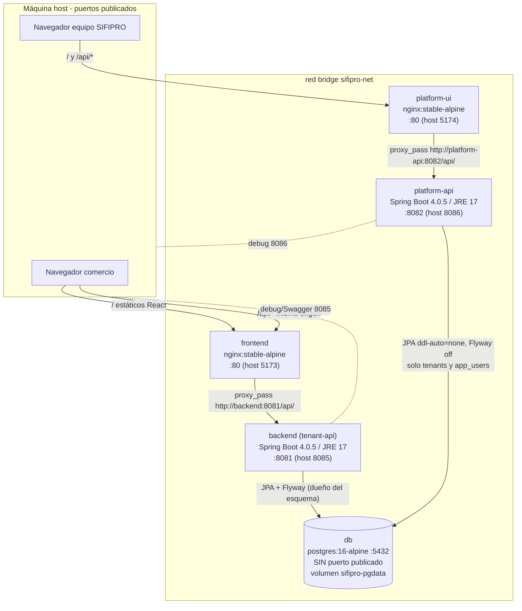
```mermaid
flowchart TB
  subgraph Host[Máquina host - puertos publicados]
    B1[Navegador comercio]
    B2[Navegador equipo SIFIPRO]
  end
  subgraph Net[red bridge sifipro-net]
    FE["frontend<br/>nginx:stable-alpine<br/>:80 (host 5173)"]
    PU["platform-ui<br/>nginx:stable-alpine<br/>:80 (host 5174)"]
    BE["backend (tenant-api)<br/>Spring Boot 4.0.5 / JRE 17<br/>:8081 (host 8085)"]
    PA["platform-api<br/>Spring Boot 4.0.5 / JRE 17<br/>:8082 (host 8086)"]
    DB[("db<br/>postgres:16-alpine :5432<br/>SIN puerto publicado<br/>volumen sifipro-pgdata")]
  end
  B1 -->|"/ estáticos React"| FE
  B1 -->|"/api/* mismo origen"| FE
  FE -->|"proxy_pass http://backend:8081/api/"| BE
  B2 -->|"/ y /api/*"| PU
  PU -->|"proxy_pass http://platform-api:8082/api/"| PA
  BE -->|"JPA + Flyway (dueño del esquema)"| DB
  PA -->|"JPA ddl-auto=none, Flyway off<br/>solo tenants y app_users"| DB
  BE -. "debug/Swagger 8085" .- Host
  PA -. "debug 8086" .- Host
```

- Fuente: `docker-compose.yml:9-117`, `sifipro-frontend/nginx.conf:10-18`, `sifipro-platform-ui/nginx.conf:10-18` [V]; estado vivo con `docker compose ps` (5 *Up*, db *healthy*) [L].
- Ningún frontend llama cross-origin: nginx sirve la SPA (`try_files … /index.html`), proxea `/api/`, cachea estáticos 1 año, `index.html` sin caché y gzip.
- **Por qué dos planos** (commits `ccfeff1`…`e03654a`; plan en `docs/audit/05-plan-de-trabajo.md`):
  1. **Seguridad por separación de audiencias:** el operador de plataforma no tiene tenant y no debe poder operar datos de comercios; cada plano firma con su propio secreto, por lo que un token robado de un plano no sirve en el otro [V][L].
  2. **Responsabilidad única:** el ciclo de vida del tenant (alta, activación) es un proceso de negocio SaaS distinto de la operación de un comercio; se retiró el "onboarding" que vivía en tenant-api (`99c36a2`).
  3. **Superficie reducida:** platform-api solo mapea `tenants` y `app_users` y nunca migra el esquema.
  4. **Escalabilidad/despliegue independiente:** cada plano puede versionarse y escalarse por separado (hoy comparten BD, ver ADR-02).
- **Acoplamiento remanente:** ambos planos comparten la BD y la tabla `app_users`; la entidad `Tenant`/`AppUser` y el enum `UserRole` están duplicados en los dos servicios (`PA/user/entity/UserRole.java:3-9` lo documenta).

## B2. Stack real y versiones

| Capa | Tecnología | Versión exacta | Fuente |
|---|---|---|---|
| Lenguaje backend | Java | 17 | `pom.xml:30` (ambos) |
| Framework | Spring Boot (parent) | **4.0.5** | `sifipro-backend/pom.xml:8`, `sifipro-platform-api/pom.xml:8` |
| Starters | web**mvc**, data-jpa, security, validation, actuator, flyway (solo backend), devtools | gestionados por Boot 4.0.5 | `pom.xml` |
| JWT | io.jsonwebtoken jjwt-api/impl/jackson | **0.12.6** | `pom.xml:62-78` / `53-69` |
| OpenAPI | springdoc-openapi-starter-webmvc-ui | **3.0.3** (solo backend) | `sifipro-backend/pom.xml:37-41` |
| Migraciones | Flyway + flyway-database-postgresql | gestionado por Boot | `sifipro-backend/pom.xml:46-49,79-82` |
| Driver | org.postgresql:postgresql | gestionado por Boot | `pom.xml` |
| Build | Maven Wrapper | `.mvn/wrapper` | |
| Versión artefacto | backend `1.0.1-RELEASE`; platform-api `0.1.0-SNAPSHOT` | | `pom.xml:13` |
| Imagen build Java | eclipse-temurin | `17-jdk-alpine` | Dockerfiles `:7` |
| Imagen runtime Java | eclipse-temurin | `17-jre-alpine` | Dockerfiles `:26` |
| Base de datos | PostgreSQL | imagen `postgres:16-alpine`; servidor **16.15** | `docker-compose.yml:13`; `SELECT version()` [L] |
| Imagen build Node | node | `22-alpine` | Dockerfiles de UIs `:7` |
| Servidor web | nginx | `stable-alpine` | Dockerfiles de UIs `:25-26` |

| Frontend (instalado según `package-lock.json`) | tenant-ui | platform-ui |
|---|---|---|
| React / React DOM | 19.2.5 | 19.2.8 |
| react-router-dom | 7.14.1 | 7.18.3 |
| Vite | 8.0.8 | 8.2.2 |
| @vitejs/plugin-react | 6.0.1 | 6.1.1 |
| Tailwind CSS (+ @tailwindcss/vite) | 4.2.2 | 4.3.3 |
| TypeScript | 6.0.3 | 6.0.3 |
| Axios | 1.15.1 | 1.20.0 |
| Sonner | 2.0.7 | 2.0.8 |
| lucide-react | 1.16.0 | 1.37.0 |
| Recharts | 3.8.1 | — |
| ESLint | 9.39.4 | 9.39.5 |

Ambos `package.json` declaran los mismos rangos (`^`), pero los lockfiles resolvieron versiones distintas → **drift** entre las dos UIs.

## B3. Estructura de cada subproyecto

### sifipro-backend (tenant-api) — `BE/`
Arquitectura en capas **por módulo de dominio** (package-by-feature), cada uno con `controller / service (interfaz + Impl) / repository / entity / dto`:

| Paquete | Contenido |
|---|---|
| `auth/` | `AuthController`, `AuthService(Impl)`, DTOs (`LoginRequest`, `AuthResponse`, `AuthUserResponse`, `TenantSummaryResponse`), `security/` (`JwtService`, `JwtAuthenticationFilter`, `CustomUserDetailsService`, `RestAuthenticationEntryPoint`, `RestAccessDeniedHandler`) |
| `config/` | `SecurityConfig`, `CorsConfig`, `OpenApiConfig`, `JpaAuditingConfig`, `DevDataSeederConfig` |
| `customer/` | `CustomerTier` (enum con lógica), controlador, `CustomerService` + `CustomerProfileService`, 9 DTOs |
| `loyalty/` | Programa de lealtad (`ProgramConfig`) |
| `reward/`, `redemption/`, `transaction/` | Catálogo, canjes, compras + ledger (`PointsMovement`, `PointsMovementType`) |
| `user/` | Usuarios internos (`AppUser`, `UserRole`) |
| `tenant/` | Solo entidad y repositorio (el ciclo de vida lo maneja platform-api) |
| `shared/` | `BaseEntity` (id IDENTITY + `createdAt`/`updatedAt` con JPA Auditing), `HealthController`, `exception/` (`GlobalExceptionHandler`, `BusinessException`, `ResourceNotFoundException`, `ApiErrorResponse` record) |

Patrones: DTOs de entrada/salida separados de entidades; **mappers manuales** (`toResponse(...)` privados en cada ServiceImpl, sin MapStruct); **validación** con Bean Validation en DTOs + `@Valid` en controladores + validaciones de negocio en servicios; **manejo global de excepciones** con `@RestControllerAdvice` (400 validación/negocio, 404 no encontrado, 409 lock optimista e integridad, 403, 500 genérico); **inyección por constructor**; `@Transactional` en todos los métodos de servicio (lectura `readOnly=true`); anotaciones OpenAPI (`@Tag`, `@Operation`, `@Schema`) en controladores y DTOs; `open-in-view=false`. Sin Lombok (getters/setters escritos a mano). Cada servicio repite `findAuthenticatedUser` y `normalizeEmail` (7 copias).

### sifipro-platform-api — `PA/`
Misma estructura reducida: `auth/` (idéntica en forma a la del backend, con rol restringido), `config/SecurityConfig`, `health/HealthController` (consulta `SELECT COUNT(*) FROM app_users` con `JdbcTemplate`), `shared/exception/` (+ `ConflictException` → 409), `tenant/` (controller, service, DTOs, entidad `Tenant` sin `BaseEntity`, fechas asignadas a mano), `user/` (entidad `AppUser` completa, repositorio). Sin OpenAPI, sin seeder, sin Flyway.

### sifipro-frontend (tenant-ui) — `FE/`
```
app/router/     AppRouter (createBrowserRouter), routes.ts (navegación + roles)
auth/           AuthContext, ProtectedRoute, auth.service, role-utils, useAuth, tipos
components/     layout/ (AppLayout, Sidebar, AppHeader) · ui/ (Button, SurfaceCard, InlineAlert, ThemeToggle, ModulePlaceholder, form/*)
lib/            api-client (Axios + interceptor 401), error-utils, formatters, date-utils, theme
modules/<dominio>/  Página + components/ + <dominio>.service.ts + <dominio>.types.ts
pages/          NotFoundPage
```
Patrones: módulos por dominio con servicio (llamadas Axios) y tipos TS propios; Context API para sesión (`AuthContext`) y programa actual (`ProgramContext`); estado local con `useState/useEffect` (sin React Query/Redux); modales controlados con validación manual; estados loading/empty/error explícitos por página; Tailwind v4 con modo oscuro por clase.

### sifipro-platform-ui — `PU/`
Mismo esqueleto (fork de tenant-ui) con un único módulo `modules/tenants/`. 18 archivos de `components/ui/**`, `lib/*` y `AppLayout` son **byte a byte idénticos** a los de tenant-ui (verificado con `diff`) [L].

## B4. Modelo de datos

Base `sifipro_db`, esquema `public`. 8 tablas de negocio + `flyway_schema_history`. Todas las tablas de negocio tienen `id bigint` identity, `created_at` y `updated_at` NOT NULL (`MIG/V1__baseline_schema.sql`) [V][L].

| Tabla | Columnas clave | FKs | Índices / constraints | Filas vivas [L] |
|---|---|---|---|---|
| `tenants` | name varchar(150), code varchar(100), active bool default true | — | `uk_tenants_code UNIQUE(code)` | 2 |
| `app_users` | first/last_name(100), email(150), password_hash(255), role(20), active, **tenant_id NULL** (desde V2) | tenant_id→tenants | `UNIQUE(email)` global; `app_users_role_check` (ADMIN/STAFF/PLATFORM_ADMIN); `idx_app_users_tenant_id` | 4 |
| `program_config` | program_name(100), points_per_dollar numeric(12,4), minimum_purchase_amount numeric(12,2), active, tenant_id | tenant_id→tenants | `uk_program_config_tenant_program_name_lower (tenant_id, lower(program_name))`; `idx_program_config_tenant_id` | 1 |
| `customers` | first/last_name, email(150), phone(30), points_balance numeric(12,4), active, tenant_id, **version** | tenant_id→tenants | `UNIQUE(email)` **global**; `uk_customers_tenant_email_lower (tenant_id, lower(email))`; `idx_customers_tenant_id` | 3 |
| `rewards` | name(120), description(500), required_points numeric(12,4), stock int, active, image_url(500), tenant_id, program_config_id, **version** | tenant→tenants, program→program_config | `uk_rewards_program_name_lower (program_config_id, lower(name))`; idx por tenant y programa | 3 |
| `purchase_transactions` | amount numeric(12,2), description(300), transaction_date, points_earned numeric(12,4), customer_id, tenant_id, program_config_id, created_by | customer, tenant, program | idx tenant; idx (tenant, programa) | 5 |
| `redemptions` | notes(300), points_used numeric(12,4), redemption_date, status(20), customer_id, reward_id, tenant_id, program_config_id, created_by | customer, reward, tenant, program | `redemptions_status_check` (COMPLETED/CANCELLED); idx (customer, tenant), tenant, (tenant, programa) | 1 |
| `points_movements` | type(20), points numeric(12,4), description(300), reference_type(50), reference_id, customer_id, tenant_id, program_config_id, created_by | customer, tenant, program | `points_movements_type_check`; idx tenant; idx (tenant, programa) | 5 |

**Faltantes de integridad (a nivel BD):** sin `CHECK (stock >= 0)`, `CHECK (points_balance >= 0)`, `CHECK (amount > 0)`, `CHECK (points_per_dollar > 0)`; `created_by` sin FK a `app_users`; `reference_id` polimórfico sin FK; sin CHECK que obligue `tenant_id NULL ⇔ role = PLATFORM_ADMIN`; `version` nullable; sin triggers (ledger mutable); nombres de constraints generados por Hibernate (`uk4vj92…`, `fk2nkje…`) mezclados con nombres manuales. No hay índice por `customer_id` en `points_movements` ni `purchase_transactions` aunque se consultan por cliente (solo la FK).

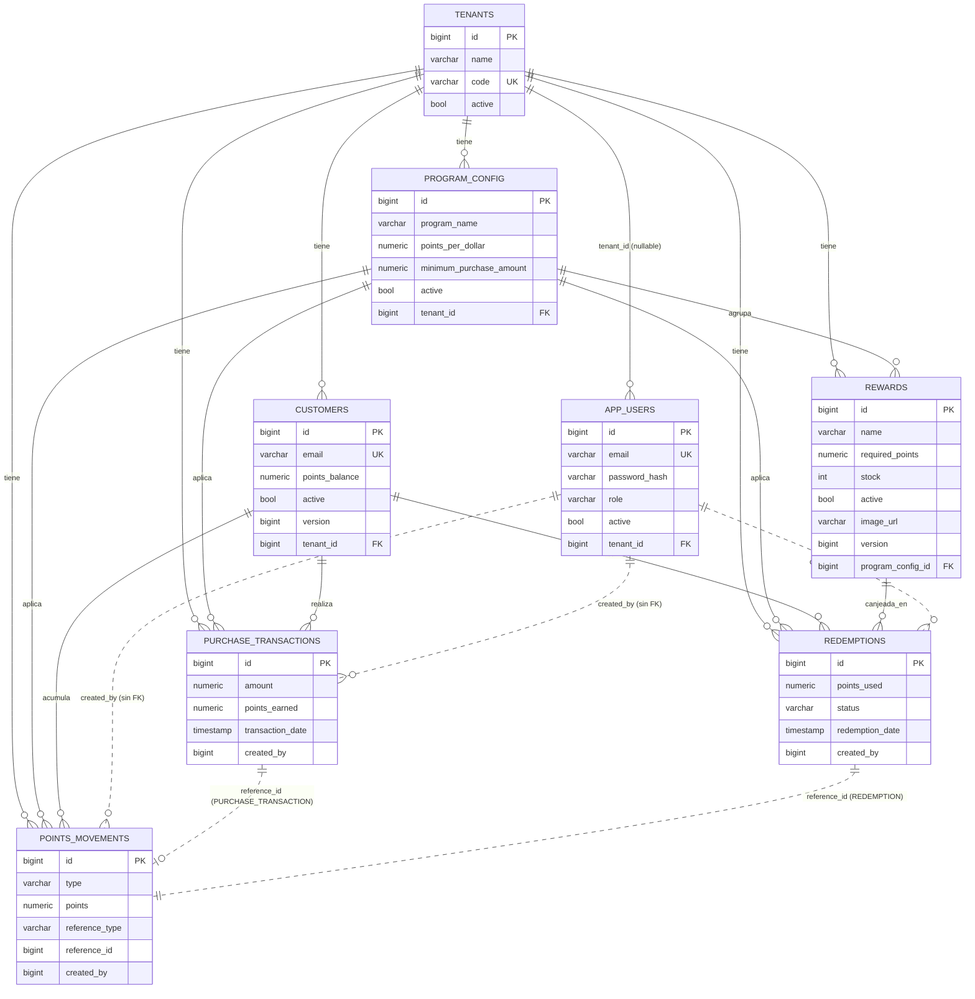
```mermaid
erDiagram
  TENANTS ||--o{ APP_USERS : "tenant_id (nullable)"
  TENANTS ||--o{ PROGRAM_CONFIG : tiene
  TENANTS ||--o{ CUSTOMERS : tiene
  TENANTS ||--o{ REWARDS : tiene
  TENANTS ||--o{ PURCHASE_TRANSACTIONS : tiene
  TENANTS ||--o{ REDEMPTIONS : tiene
  TENANTS ||--o{ POINTS_MOVEMENTS : tiene
  PROGRAM_CONFIG ||--o{ REWARDS : agrupa
  PROGRAM_CONFIG ||--o{ PURCHASE_TRANSACTIONS : aplica
  PROGRAM_CONFIG ||--o{ REDEMPTIONS : aplica
  PROGRAM_CONFIG ||--o{ POINTS_MOVEMENTS : aplica
  CUSTOMERS ||--o{ PURCHASE_TRANSACTIONS : realiza
  CUSTOMERS ||--o{ REDEMPTIONS : realiza
  CUSTOMERS ||--o{ POINTS_MOVEMENTS : acumula
  REWARDS ||--o{ REDEMPTIONS : canjeada_en
  APP_USERS ||..o{ PURCHASE_TRANSACTIONS : "created_by (sin FK)"
  APP_USERS ||..o{ REDEMPTIONS : "created_by (sin FK)"
  APP_USERS ||..o{ POINTS_MOVEMENTS : "created_by (sin FK)"
  PURCHASE_TRANSACTIONS ||..o| POINTS_MOVEMENTS : "reference_id (PURCHASE_TRANSACTION)"
  REDEMPTIONS ||..|| POINTS_MOVEMENTS : "reference_id (REDEMPTION)"

  TENANTS {
    bigint id PK
    varchar name
    varchar code UK
    bool active
  }
  APP_USERS {
    bigint id PK
    varchar email UK
    varchar password_hash
    varchar role
    bool active
    bigint tenant_id FK
  }
  PROGRAM_CONFIG {
    bigint id PK
    varchar program_name
    numeric points_per_dollar
    numeric minimum_purchase_amount
    bool active
    bigint tenant_id FK
  }
  CUSTOMERS {
    bigint id PK
    varchar email UK
    numeric points_balance
    bool active
    bigint version
    bigint tenant_id FK
  }
  REWARDS {
    bigint id PK
    varchar name
    numeric required_points
    int stock
    bool active
    varchar image_url
    bigint version
    bigint program_config_id FK
  }
  PURCHASE_TRANSACTIONS {
    bigint id PK
    numeric amount
    numeric points_earned
    timestamp transaction_date
    bigint created_by
  }
  REDEMPTIONS {
    bigint id PK
    numeric points_used
    varchar status
    timestamp redemption_date
    bigint created_by
  }
  POINTS_MOVEMENTS {
    bigint id PK
    varchar type
    numeric points
    varchar reference_type
    bigint reference_id
    bigint created_by
  }
```

### Migraciones Flyway (en orden)

| # | Archivo | Qué hace | Estado BD viva [L] |
|---|---|---|---|
| V1 | `MIG/V1__baseline_schema.sql` (619 líneas) | Snapshot `pg_dump --schema-only` del esquema que Hibernate `ddl-auto=update` había creado: 8 tablas, identities, PK, UNIQUE, CHECK, 12 índices, 15 FKs. Documenta que desde aquí los cambios van por Flyway (`:1-14`). | aplicada 2026-08-30, success |
| V2 | `MIG/V2__platform_operator_support.sql` | `app_users.tenant_id` pasa a NULL; recrea `app_users_role_check` con `PLATFORM_ADMIN`. | aplicada, success |
| — | `db/manual-applied/APPLIED__V6__refactor_transactions_program_scope.sql` | Script histórico aplicado a mano antes de Flyway (backfill de `tenant_id`/`program_config_id` en compras y movimientos). Renombrado con prefijo `APPLIED__` para que Flyway no lo lea; marcado "NO EJECUTAR OTRA VEZ". | fuera de Flyway |

Configuración: `spring.flyway.enabled=true`, `baseline-on-migrate=true` (`application.properties:5-6`), `ddl-auto=validate` (`application-dev.properties:8`) → Hibernate ya no modifica el esquema, solo lo valida. Con `baseline-on-migrate`, una BD preexistente sin historial se marca en versión 1 y solo aplica V2 [I]. V1–V5 de la era pre-Flyway no existen en el repo (la numeración "V6" del script manual lo sugiere).

## B5. Multi-tenancy

**Modelo:** una sola base de datos y un solo esquema compartidos, con `tenant_id` como discriminador en todas las tablas de negocio (**shared database, shared schema**). No hay esquemas por tenant, ni Row-Level Security de PostgreSQL, ni filtros Hibernate (`@Filter`/`@TenantId`), ni `TenantContext` en `ThreadLocal`.

**Mecanismo:** **filtro manual en cada repositorio**. Cada ServiceImpl:
1. Obtiene el email de `Authentication.getName()` (pasado desde el controlador).
2. `findAuthenticatedUser(email)` → `AppUser` → `tenant.id` (7 implementaciones copiadas, p.ej. `BE/customer/service/CustomerServiceImpl.java:122-131`).
3. Usa exclusivamente consultas derivadas con `…AndTenantId` / `findAllByTenantId…` y valida que las entidades relacionadas (programa, cliente, recompensa) también pertenezcan al tenant antes de usarlas.
4. En escrituras asigna `setTenant(currentUser.getTenant())`, nunca un tenant recibido del cliente (los DTO no tienen `tenantId`).

### Revisión endpoint por endpoint (tenant-api)

| Endpoint | Consulta usada | ¿Scope por tenant? | Riesgo |
|---|---|---|---|
| `GET /api/customers` | `findAllByTenantIdOrderByIdDesc` | ✅ | — |
| `GET/PUT /api/customers/{id}`, `PATCH …/activate|deactivate` | `findByIdAndTenantId` | ✅ | — |
| `GET /api/customers/{id}/profile` | cliente `findByIdAndTenantId`; compras y canjes `findAllByCustomerIdAndTenantId…` | ✅ | — |
| `GET /api/customers/{id}/points-history` | `findAllByCustomerIdAndTenantIdOrderByIdAsc` | ✅ | — |
| `POST /api/customers` | `existsByEmailIgnoreCaseAndTenantId` | ✅ | colisión con `UNIQUE(email)` global revela que el email existe en otro tenant (409) |
| `GET /api/program-config`, `/{id}`, `PUT`, `PATCH` | `findAllByTenantId…`, `findByIdAndTenantId` | ✅ | — |
| `GET /api/rewards`, `/programs/{pid}`, `/{id}`, `PUT`, `PATCH` | `findAllByTenantId…`, programa validado con `findByIdAndTenantId`, `findByIdAndTenantId` | ✅ | — |
| `POST /api/rewards` | programa `findByIdAndTenantId`; `existsByNameIgnoreCaseAndProgramConfigId` | ✅ | — |
| `POST /api/transactions` | cliente y programa `findByIdAndTenantId` | ✅ | — |
| `GET /api/transactions`, `/{id}`, `/program/{pid}`, `/customer/{cid}` y sus `points-movements` | variantes `…AndTenantId…` + validación previa de programa/cliente | ✅ | — |
| `POST /api/redemptions` | cliente y recompensa `findByIdAndTenantId`; ledger `findAllByCustomerIdAndTenantIdAndProgramConfigId…` | ✅ | — |
| `GET /api/redemptions`, `/{id}`, `/customer/{cid}` | `…AndTenantId…` | ✅ | — |
| `GET/PUT /api/users/{id}`, `PATCH …` | `findByIdAndTenantId` | ✅ | — |
| `POST/PUT /api/users` | `existsByEmailIgnoreCase` (global) | ⚠️ | enumeración: revela si un email existe en cualquier tenant; **acepta rol PLATFORM_ADMIN** (escalada, B6) |
| `GET /api/auth/me` | por email del token | ✅ | — |

**Resultado:** no se encontró ningún endpoint que busque por ID sin validar el tenant [V]. El historial muestra que sí existió una fuga (`/api/reports/*`, eliminada en `47b9cc3`).

**Riesgos latentes (código muerto sin scope, hoy no invocado):** `PointsMovementRepository.findByCustomerIdOrderByCreatedAtDesc` (`:22`), `PurchaseTransactionRepository.findByCustomerIdOrderByTransactionDateDesc` (`:18`), `findAllByOrderByTransactionDateDesc` (`:20`), `CustomerRepository.existsByEmailIgnoreCase` (`:10`), `RewardRepository.existsByNameIgnoreCase` (`:10`), `ProgramConfigRepository.findFirstByOrderByIdAsc` (`:10`); además `JpaRepository.findById/findAll` heredados están disponibles para cualquier desarrollador futuro. Grep sin usos fuera de los repositorios [V].

**Otros puntos:** el aislamiento depende de la disciplina del desarrollador (no hay mecanismo central ni test automatizado de aislamiento); el claim `tenantId` del JWT no se usa (B6); `tenant.active` no se aplica (P2).

## B6. Seguridad

### Flujo JWT

| Aspecto | tenant-api | platform-api |
|---|---|---|
| Librería | jjwt 0.12.6 | jjwt 0.12.6 |
| Algoritmo | **HS512** (jjwt elige según la longitud de la clave; header decodificado [L]) | **HS512** [L] |
| Clave | `Keys.hmacShaKeyFor(APP_JWT_SECRET UTF-8)` (`JwtService.java:82-84`) | `PLATFORM_JWT_SECRET` (`PA/…/JwtService.java:80-82`) |
| Expiración | 86 400 000 ms = 24 h (`application-dev.properties:14`) | 24 h (`application.properties:21`) |
| Claims | `sub`=email, `role`, `tenantId`, `tenantCode`, `tenantName`, `iat`, `exp` | `sub`, `role`, `iat`, `exp` |
| Validación por request | firma + `sub` = usuario cargado + no expirado (`JwtService.java:43-46`) | idem |
| ¿Revisa usuario activo? | **No** (el filtro no llama `isEnabled()`) | **No** |
| ¿Revisa tenant activo? | **No** | n/a |
| Refresh / revocación / logout servidor | No existen | No existen |
| Token inválido | el filtro lo ignora → petición anónima → 401 del entry point | idem |
| Almacenamiento cliente | `localStorage["sifipro-access-token"]` | `localStorage["platform-access-token"]` |

`iss`/`aud` no se usan; la separación entre planos descansa solo en secretos distintos (correcto mientras los secretos sean distintos, lo cual no se puede verificar sin leer `.env`; el rechazo cruzado en vivo sugiere que lo son [L]).

**Consecuencia de no revisar `isEnabled()`:** desactivar un usuario o cambiarle la contraseña no corta su sesión vigente (hasta 24 h) [V]. Si un usuario cambia de email, su token apunta a un `sub` inexistente y `loadUserByUsername` lanza `UsernameNotFoundException` dentro del filtro, fuera del `try` (`JwtAuthenticationFilter.java:49-50`); el resultado exacto (401 o 500) no se probó [I].

### Contraseñas
BCrypt (`BCryptPasswordEncoder` sin parámetros → factor 10) en ambos servicios; longitud 8–100 al crear; sin reglas de complejidad, sin bloqueo por intentos, sin recuperación de contraseña, sin cambio de contraseña propia.

### Autorización
- tenant-api: reglas por URL + método en `SecurityConfig` (`BE/config/SecurityConfig.java:53-88`); **no** hay `@PreAuthorize` en métodos. Todo lo no listado exige autenticación.
- platform-api: todo `/api/platform/**` requiere `PLATFORM_ADMIN` salvo login y health (`PA/config/SecurityConfig.java:52-61`).
- **🔴 Escalada de privilegios tenant → plataforma:** `CreateUserRequest.role` y `UpdateUserRequest.role` son `UserRole` sin restricción; `UserServiceImpl` los persiste tal cual (`:43`, `:84`); la BD permite `PLATFORM_ADMIN` con `tenant_id` no nulo; platform-api autentica a cualquier `PLATFORM_ADMIN` sin mirar el tenant (`CustomUserDetailsService.java:30`) y le da acceso a todos los tenants. Secuencia: ADMIN → `POST /api/users {"role":"PLATFORM_ADMIN",...}` → login en `:8086/api/platform/auth/login` → control de la plataforma [V; no ejecutado para no escribir datos]. La UI no ofrece esa opción (`FE/modules/users/components/UserFormModal.tsx:290-291`), pero la API sí.

### CORS
- tenant-api: solo `http://localhost:5173`, métodos GET/POST/PUT/PATCH/DELETE/OPTIONS, headers `*`, credenciales true (`BE/config/CorsConfig.java:14-24`). Irrelevante en Docker (mismo origen vía nginx); necesario en desarrollo local porque `vite.config.ts` de tenant-ui **no** tiene proxy.
- platform-api: `.cors(withDefaults())` sin `CorsConfigurationSource` → sin cabeceras CORS; funciona porque platform-ui usa proxy (nginx y Vite).

### Secretos
- Variables requeridas (sin valores por defecto): `POSTGRES_PASSWORD`, `DB_USERNAME`, `DB_PASSWORD`, `APP_JWT_SECRET`, `PLATFORM_JWT_SECRET` (raíz `.env`, que existe localmente y está en `.gitignore` [V]); `VITE_API_BASE_URL` en `sifipro-frontend/.env` y `sifipro-platform-ui/.env` (no versionados, excluidos del build por `.dockerignore`).
- `.env.example` documenta las 5 variables con placeholders y la instrucción de usar secretos distintos por plano (`.env.example:1-22`).
- **Riesgo histórico:** hasta el commit `4d437aa` (29-ago) la contraseña de BD y el secreto JWT estaban en claro en `docker-compose.yml` y `application-dev.properties`; siguen en el historial git y además **transcritos en `docs/audit/01-infra.md:49`** (no se reproducen aquí). Si el repositorio es o fue público, deben considerarse comprometidos [I].
- El healthcheck de `db` usa `-U sifipro` literal en vez de `${DB_USERNAME}` (`docker-compose.yml:23`).

### Actuator y Swagger
- Actuator expone solo `health,info` (`application.properties:8` / `:23`) y son públicos; `/actuator/health` responde `{"status":"UP", groups…}` sin detalles [L].
- Swagger UI y `/v3/api-docs` del backend son **públicos** (`SecurityConfig.java:57-59`; 200 en vivo [L]); publicados en el host por el puerto 8085.
- platform-api no tiene springdoc (`/v3/api-docs` → 401 [L]).
- `GET /api/platform/health` es público y revela `appUsersCount` (4) [L].

### Otros
- CSRF deshabilitado (correcto para API stateless con Bearer).
- Login tenant fallido devuelve **400** (no 401) y mensajes diferenciados: "User account is inactive." aparece aunque la contraseña sea incorrecta, porque `DisabledException` se lanza en las comprobaciones previas a la contraseña → permite enumerar cuentas inactivas [I, por comportamiento estándar de `DaoAuthenticationProvider`]. Login de PLATFORM_ADMIN en el plano tenant devuelve "not associated with a tenant" solo tras validar la contraseña [L].
- Sin rate limiting ni protección de fuerza bruta; sin cabeceras de seguridad en nginx (CSP, HSTS, X-Frame-Options); sin TLS.
- El manejador genérico 500 devuelve `ex.getMessage()` en `details` (`GlobalExceptionHandler.java:104-115`) y el de integridad devuelve el mensaje SQL (`:71-83`) → fuga de detalles internos.
- `spring.jpa.show-sql=true` en el único perfil existente (logs verbosos con SQL).

## B7. Inventario completo de la API

### tenant-api (`sifipro-backend`, `http://localhost:8085` directo o `/api` vía tenant-ui)

| Método | Ruta | Rol | Request → Response | Controlador |
|---|---|---|---|---|
| POST | `/api/auth/login` | público | `{email,password}` → 200 `{accessToken,tokenType,user{…,tenant}}` / 400 | `AuthController.login` |
| GET | `/api/auth/me` | autenticado | → 200 `AuthUserResponse` | `AuthController.getCurrentUser` |
| GET | `/api/health` | público | → `{status:"ok",app}` | `HealthController.health` |
| GET | `/actuator/health`, `/actuator/info` | público | estado | Actuator |
| GET | `/swagger-ui.html`, `/v3/api-docs/**` | público | OpenAPI | springdoc |
| POST | `/api/customers` | ADMIN, STAFF | `{firstName,lastName,email,phone?}` → 201 `CustomerResponse{…,pointsBalance,tier,tierProgress}` | `CustomerController.createCustomer` |
| GET | `/api/customers` | ADMIN, STAFF | → `CustomerResponse[]` | `getAllCustomers` |
| GET | `/api/customers/{id}` | ADMIN, STAFF | → `CustomerResponse` / 404 | `getCustomerById` |
| PUT | `/api/customers/{id}` | ADMIN | `{firstName,lastName,email,phone?}` → `CustomerResponse` | `updateCustomer` |
| PATCH | `/api/customers/{id}/activate` | ADMIN | → `CustomerResponse` | `activateCustomer` |
| PATCH | `/api/customers/{id}/deactivate` | ADMIN | → `CustomerResponse` | `deactivateCustomer` |
| GET | `/api/customers/{id}/profile` | ADMIN, STAFF | → `CustomerProfileResponse{stats,tierProgress,recentTransactions(5),recentRedemptions(3)}` | `getCustomerProfile` |
| GET | `/api/customers/{id}/points-history` | ADMIN, STAFF | → `[{date,type,points,runningBalance,description,programName,createdBy}]` | `getCustomerPointsHistory` |
| POST | `/api/program-config` | ADMIN | `{programName,pointsPerDollar,minimumPurchaseAmount,active}` → 201 `ProgramConfigResponse` | `ProgramConfigController.createProgramConfig` |
| GET | `/api/program-config` | ADMIN, STAFF | → `ProgramConfigResponse[]` | `getAllProgramConfigs` |
| GET | `/api/program-config/{id}` | ADMIN, STAFF | → `ProgramConfigResponse` | `getProgramConfigById` |
| PUT | `/api/program-config/{id}` | ADMIN | igual a crear → `ProgramConfigResponse` | `updateProgramConfig` |
| PATCH | `/api/program-config/{id}/activate` · `/deactivate` | ADMIN | → `ProgramConfigResponse` | `activate/deactivateProgramConfig` |
| POST | `/api/rewards` | ADMIN | `{name,description?,requiredPoints,stock,programConfigId,imageUrl?}` → 201 `RewardResponse` | `RewardController.createReward` |
| GET | `/api/rewards` | ADMIN, STAFF | → `RewardResponse[]` (todas las del tenant) | `getAllRewards` |
| GET | `/api/rewards/programs/{programConfigId}` | ADMIN, STAFF | → `RewardResponse[]` | `getRewardsByProgram` |
| GET | `/api/rewards/{id}` | ADMIN, STAFF | → `RewardResponse` | `getRewardById` |
| PUT | `/api/rewards/{id}` | ADMIN | igual a crear → `RewardResponse` | `updateReward` |
| PATCH | `/api/rewards/{id}/activate` · `/deactivate` | ADMIN | → `RewardResponse` | `activate/deactivateReward` |
| POST | `/api/transactions` | ADMIN, STAFF | `{customerId,programConfigId,amount,description?,transactionDate}` → 201 `PurchaseTransactionResponse{…,pointsEarned,awardedPoints,createdBy}` | `PurchaseTransactionController.createPurchaseTransaction` |
| GET | `/api/transactions` | ADMIN, STAFF | → `PurchaseTransactionResponse[]` | `getAllTransactions` |
| GET | `/api/transactions/{id}` | ADMIN, STAFF | → uno / 404 | `getTransactionById` |
| GET | `/api/transactions/program/{programConfigId}` | ADMIN, STAFF | → lista | `getTransactionsByProgram` |
| GET | `/api/transactions/customer/{customerId}` | ADMIN, STAFF | → lista | `getTransactionsByCustomerId` |
| GET | `/api/transactions/points-movements` | ADMIN, STAFF | → `PointsMovementResponse[]` | `getAllPointsMovements` |
| GET | `/api/transactions/program/{programConfigId}/points-movements` | ADMIN, STAFF | → lista | `getPointsMovementsByProgram` |
| GET | `/api/transactions/customer/{customerId}/points-movements` | ADMIN, STAFF | → lista | `getPointsMovementsByCustomerId` |
| POST | `/api/redemptions` | ADMIN, STAFF | `{customerId,rewardId,redemptionDate,notes?}` → 201 `RedemptionResponse{…,pointsUsed,status,createdBy}` | `RedemptionController.createRedemption` |
| GET | `/api/redemptions` | ADMIN, STAFF | → lista (orden id desc) | `getAllRedemptions` |
| GET | `/api/redemptions/{id}` | ADMIN, STAFF | → uno | `getRedemptionById` |
| GET | `/api/redemptions/customer/{customerId}` | ADMIN, STAFF | → lista | `getRedemptionsByCustomerId` |
| POST | `/api/users` | ADMIN | `{firstName,lastName,email,password,role}` → 201 `UserResponse` | `UserController.createUser` |
| GET | `/api/users` | ADMIN | → `UserResponse[]` | `getAllUsers` |
| GET | `/api/users/{id}` | ADMIN | → `UserResponse` | `getUserById` |
| PUT | `/api/users/{id}` | ADMIN | `{firstName,lastName,email,role}` → `UserResponse` | `updateUser` |
| PATCH | `/api/users/{id}/activate` · `/deactivate` | ADMIN | → `UserResponse` | `activate/deactivateUser` |
| PATCH | `/api/users/{id}/password` | ADMIN | `{password}` → 204 | `updatePassword` |

Total: **43 operaciones de negocio** + health/actuator/swagger. Ninguna lista está paginada. Las descripciones OpenAPI de algunos listados dicen "ordered by transaction date descending" pero el código ordena por `id` descendente (`PurchaseTransactionController.java:46`, `RedemptionController.java:43`).

### platform-api (`sifipro-platform-api`, `http://localhost:8086` directo o `/api` vía platform-ui)

| Método | Ruta | Rol | Request → Response | Controlador |
|---|---|---|---|---|
| POST | `/api/platform/auth/login` | público | `{email,password}` → 200 `{accessToken,tokenType,user{id,email,role,active}}` / 401 | `AuthController.login` |
| GET | `/api/platform/auth/me` | PLATFORM_ADMIN | → `AuthUserResponse` | `AuthController.getCurrentUser` |
| GET | `/api/platform/health` | público | → `{status,app,database,appUsersCount}` | `HealthController.health` |
| GET | `/actuator/health`, `/actuator/info` | público | estado | Actuator |
| POST | `/api/platform/tenants` | PLATFORM_ADMIN | `{name,code,adminFirstName,adminLastName,adminEmail,adminPassword}` → 201 `TenantResponse{id,name,code,active,createdAt,updatedAt}` / 409 | `TenantController.createTenant` |
| GET | `/api/platform/tenants?page&size&sort` | PLATFORM_ADMIN | → `Page<TenantResponse>` (default 20, `createdAt DESC`) | `listTenants` |
| GET | `/api/platform/tenants/{id}` | PLATFORM_ADMIN | → `TenantResponse` / 404 | `getTenantById` |
| PATCH | `/api/platform/tenants/{id}/activate` | PLATFORM_ADMIN | → `TenantResponse` | `activateTenant` |
| PATCH | `/api/platform/tenants/{id}/deactivate` | PLATFORM_ADMIN | → `TenantResponse` | `deactivateTenant` |

Sin documentación OpenAPI. El parámetro `sort` acepta cualquier propiedad; una propiedad inexistente probablemente produce 500 [I].

## B8. Concurrencia e integridad

| Operación | Transacción | Control de concurrencia | Evaluación |
|---|---|---|---|
| Alta de tenant + ADMIN | `@Transactional` (`TenantServiceImpl.java:37`) | UNIQUE en `code` y `email` como red de seguridad | ✅ Atómica. Carrera entre dos altas con mismo código → la segunda choca con el UNIQUE → **500** genérico en platform-api (no hay handler de `DataIntegrityViolationException` allí) [I]. |
| Compra | `@Transactional` (`PurchaseTransactionServiceImpl.java:51`) | `@Version` en `Customer` | ✅ Dos compras simultáneas del mismo cliente: una recibe 409 (no se pierde saldo, pero hay que reintentar). |
| Canje | `@Transactional` (`RedemptionServiceImpl.java:51`) | `@Version` en `Customer` y `Reward` | ✅ Evita sobreventa y doble gasto (test `RedemptionConcurrencyIntegrationTest`: 2 hilos, stock 1 → 1 éxito, 1 `OptimisticLockingFailureException`, stock final 0). |
| Saldo por programa | lectura del ledger dentro de la misma transacción | protegido indirectamente por la versión de `Customer` (todo canje/compra la incrementa) | ✅ razonable. |
| Edición de recompensa vs canje | `@Transactional` | `@Version` en `Reward` | ✅ uno de los dos falla con 409. |
| Programa, usuario, tenant | `@Transactional` | sin `@Version` | ⚠️ "último en escribir gana" (bajo riesgo). |

**Consistencia saldo ↔ ledger:** se mantiene en el mismo `@Transactional` y en la BD viva coincide al 100 % [L]. Pero existen **dos fuentes de verdad**: `customers.points_balance` (global, usado para tier y perfil) y el ledger por programa (usado para autorizar canjes). Un cliente con puntos en el programa A no puede canjear en B aunque su saldo global lo muestre suficiente — la UI muestra el saldo global en el selector de canje sin advertir esto.

**Sin salvaguardas en BD:** stock y saldo negativos solo los impide la aplicación (no hay CHECK); un `UPDATE` manual o un bug futuro podría dejarlos negativos.

**Otros:** `open-in-view=false` evita consultas perezosas fuera de transacción; `readOnly=true` en lecturas; las listas completas se cargan en memoria (sin paginación) — el `calculateProgramBalance` recorre todo el ledger del cliente en cada canje (O(n)).

## B9. Frontend

### Routing y guards
- `createBrowserRouter` con rutas anidadas bajo un layout protegido (`FE/app/router/AppRouter.tsx:23-96`; `PU/app/router/AppRouter.tsx:14-51`).
- `ProtectedRoute` (idéntico en lógica en ambas UIs): muestra "Restoring secure session..." mientras carga; sin sesión → `/login`; rol no permitido → `defaultRoute`; con sesión en `/login` → `defaultRoute`.
- tenant-ui: `/users` y `/program-config` con `allowedRoles={["ADMIN"]}`; el Sidebar filtra los mismos ítems por rol (`FE/components/layout/Sidebar.tsx:35-37`). **No hay control por rol a nivel de botones** dentro de páginas.
- platform-ui: una sola sección (`/tenants`); la ruta `/dashboard` redirige por compatibilidad.

### Manejo de token
- `localStorage` (clave `sifipro-access-token` / `platform-access-token`); se inyecta en `apiClient.defaults.headers.common.Authorization` (`FE/lib/api-client.ts:30-37`).
- Restauración de sesión llamando `/me` al cargar; si falla, se limpia.
- Sin lectura de `exp` ni refresh; al expirar, el primer 401 fuerza logout y `window.location.replace("/login")`.
- Vulnerable a robo por XSS (no hay httpOnly cookie ni CSP), mitigado solo porque React escapa por defecto.

### Cliente HTTP
- Axios, `baseURL = import.meta.env.VITE_API_BASE_URL`, `timeout: 10000`, JSON (`FE/lib/api-client.ts:1-15`, idéntico en platform-ui).
- Interceptor de respuesta: 401 → notifica a los suscriptores (`onApiUnauthorized`) → `AuthContext` limpia la sesión.
- **Inconsistencia de configuración:** el Dockerfile de tenant-ui declara `ARG/ENV VITE_API_URL` (`sifipro-frontend/Dockerfile:17-18`) y compose lo pasa (`docker-compose.yml:79-83`), pero el código lee `VITE_API_BASE_URL`; como el `.env` local está excluido del build (`.dockerignore:7`), `baseURL` queda `undefined` y Axios usa rutas relativas → funciona por coincidencia [V][L]. platform-ui sí es coherente (`VITE_API_BASE_URL` en Dockerfile y compose).

### Manejo de errores
- `extractErrorMessage` (`FE/lib/error-utils.ts:63-82`) busca `message → error → detail → details[] → title → errors{}` en la respuesta; como el backend responde `ApiErrorResponse{message,details}`, se muestra `message` (en validaciones, "Validation failed" sin el detalle de campo).
- Patrón por página: estados loading (skeleton), empty y error con Retry; toasts Sonner para acciones.
- 403 no tiene tratamiento específico (se muestra como toast "Could not …. You do not have permission…").
- `UsersPage`/`ProgramConfigPage` tratan 404/405 como "endpoint no disponible en este backend" (restos de compatibilidad).

### Componentes compartidos
`Button` (variantes, `isLoading`, iconos), `SurfaceCard`, `InlineAlert`, `ThemeToggle`, `ModulePlaceholder` (sin uso), `form/` (`FormField`, `FormLabel`, `FormHint`, `FormError`, `TextInput`, `TextArea`, `SelectField`, `CustomSelect`, `DateField`, estilos comunes). Layout: `AppLayout` (Toaster + fondo + Sidebar + Header + `Outlet`).

### Hallazgos funcionales del frontend
1. STAFF ve y puede pulsar acciones prohibidas (Clientes: Edit/Activate/Deactivate; Recompensas: New/Edit/Activate/Deactivate) → 403.
2. `RewardFormModal` no maneja `imageUrl` → las ediciones borran la imagen; no hay forma de cargar imágenes desde la UI (las tarjetas sí las muestran si existen).
3. Los formularios de transacción y canje listan también clientes **inactivos** (el backend los rechaza).
4. Si no hay recompensas activas, el modal de canje ofrece las inactivas (`RedemptionFormModal.tsx:74`).
5. Mensajes "Select a program from the header" cuando el selector está en el Dashboard.
6. Dashboard y Reportes descargan todas las entidades del tenant y filtran/agrupan en el navegador; los canjes se piden todos y se filtran por programa en cliente (también en `RedemptionsPage`).
7. `RedemptionsPage.handleSubmitRedemption` hace una llamada redundante `getRedemptionById` cuyo resultado se descarta (`:404`).
8. Textos de UI mayormente en inglés, con partes en español en platform-ui (login) → mezcla de idiomas.
9. `index.html` con `<title>sifipro-frontend</title>` y `lang="en"`.

## B10. Infraestructura y despliegue

### Dockerfiles (4, todos multi-stage)
| Servicio | Etapa build | Etapa runtime | Notas |
|---|---|---|---|
| backend | `eclipse-temurin:17-jdk-alpine`; copia wrapper + pom, `dependency:go-offline` (caché), luego `package -DskipTests` | `eclipse-temurin:17-jre-alpine`, usuario no-root `sifipro`, `EXPOSE 8081` | corrige CRLF de `mvnw`; `-Djava.security.egd` |
| platform-api | idéntico | idéntico, `EXPOSE 8082` | |
| frontend | `node:22-alpine`, `npm ci`, `ARG VITE_API_URL`, `npm run build` (`tsc -b && vite build`) | `nginx:stable-alpine` + `nginx.conf` | arg con nombre incorrecto (B9) |
| platform-ui | idéntico con `ARG VITE_API_BASE_URL=""` | idéntico | |

`.dockerignore` excluye `target/`, `node_modules/`, `.git/`, `.env*`, `*.md`.

### docker-compose.yml
- `version: '3.8'` obsoleto (Docker Compose emite warning [L]).
- `db`: `postgres:16-alpine`, `restart: unless-stopped`, volumen nombrado `sifipro-pgdata`, **healthcheck** `pg_isready` (10 s, 5 reintentos, 15 s de gracia), **sin puerto publicado**.
- `backend` y `platform-api`: `depends_on: db: condition: service_healthy`; puertos 8085/8086 publicados "solo para debug"; variables desde `.env`.
- `frontend` y `platform-ui`: `depends_on` simple (arranque, no salud) de su API.
- Sin healthchecks en los 4 servicios de aplicación, sin límites de CPU/memoria, sin `env_file`, sin perfiles de compose ni override por entorno.
- Red `sifipro-net` (bridge); `container_name` fijo para cada servicio.

### nginx
Ver B1. `proxy_read_timeout 90s`, cabeceras `X-Real-IP`/`X-Forwarded-*`. Sin TLS, sin cabeceras de seguridad, `server_name localhost`.

### Perfiles de Spring
- backend: `spring.profiles.default=dev` (`application.properties:3`); **solo existe `application-dev.properties`** (datasource, `ddl-auto=validate`, `show-sql=true`, JWT). Compose fuerza `SPRING_PROFILES_ACTIVE=dev`. El seeder `@Profile("dev")` corre siempre en Docker. **No hay perfil `prod`**; activar otro perfil dejaría sin datasource URL local (aunque `SPRING_DATASOURCE_URL` del entorno la cubriría) ni secreto JWT [I].
- platform-api: un solo `application.properties` sin perfiles.
- `spring-boot-devtools` como dependencia `runtime optional` (excluido del jar repackaged por defecto) [I].

### Operación
Sin CI/CD, sin registro de imágenes, sin backups de la BD, sin logging centralizado ni métricas (solo actuator health/info), sin TLS. Las imágenes en ejecución tienen "4 weeks ago" de creación [L] (coinciden con el último commit funcional `e03654a`).

## B11. Pruebas

| Proyecto | Clase | Tipo | Tests | Qué cubre |
|---|---|---|---|---|
| backend | `SifiproBackendApplicationTests` | `@SpringBootTest` | 1 | contexto arranca |
| backend | `redemption/RedemptionConcurrencyIntegrationTest` | integración (BD real, 2 hilos) | 1 | bloqueo optimista: 1 éxito, 1 conflicto, stock 0, 1 canje persistido |
| platform-api | `SifiproPlatformApiApplicationTests` | `@SpringBootTest` | 1 | contexto |
| platform-api | `auth/AuthControllerIntegrationTest` | MockMvc + BD real | 4 | login PLATFORM_ADMIN OK + JWT de 3 partes; ADMIN → 401; STAFF → 401; contraseña errónea → 401 |
| platform-api | `tenant/TenantControllerIntegrationTest` | MockMvc + BD real | 5 | alta persiste tenant + ADMIN con BCrypt; código duplicado → 409 sin ADMIN; email duplicado → 409 sin tenant; sin token → 401; desactivar → `active=false` |
| tenant-ui / platform-ui | — | — | **0** | sin framework de test instalado (no hay Vitest/Jest/Testing Library) |

**Total: 12 métodos de test, todos de integración.** No hay tests unitarios de la fórmula de puntos, tiers, validaciones de canje, aislamiento por tenant ni seguridad del backend.

**¿Pasan?** No se ejecutaron en esta auditoría:
- Todas las clases son `@SpringBootTest` sin BD embebida ni Testcontainers; usan el datasource del perfil `dev` → `jdbc:postgresql://localhost:5432/sifipro_db`, pero en Docker la BD **no publica el puerto 5432** (`docker compose ps` [L]) → fallarían por conexión salvo que haya un Postgres local.
- Además **escriben y borran datos reales** (tenants, usuarios, clientes, ledger) y el contexto del backend dispara el seeder `dev` → incompatible con la regla de solo lectura.
- Los Dockerfiles compilan con `-DskipTests`; no hay CI que los ejecute. El commit `878704d` sugiere que pasaron en la máquina del autor en su momento [I].

**Análisis estático ejecutado (solo lectura) [L]:** `npx eslint .` → tenant-ui **15 errores** (13 `react-hooks/set-state-in-effect`, 2 `react-refresh/only-export-components`); platform-ui **4 errores** (mismas reglas). `npm run lint` fallaría. `tsc` no se ejecutó (escribe `tsbuildinfo`).

## B12. Calidad y deuda técnica

**Duplicación**
- Kit UI + `lib/` + `AppLayout`: **18 archivos idénticos** entre tenant-ui y platform-ui; `AuthContext`, `ProtectedRoute`, `LoginPage`, `Sidebar`, `AppHeader` casi idénticos. Sin paquete compartido ni workspace.
- Backend ↔ platform-api: `JwtService`, `JwtAuthenticationFilter`, `RestAuthenticationEntryPoint`, `RestAccessDeniedHandler`, `ApiErrorResponse`, excepciones, `UserRole`, entidades `Tenant`/`AppUser` duplicadas.
- Backend: `findAuthenticatedUser`/`normalizeEmail` repetidos en 7 servicios; `buildTierProgress` duplicado en `CustomerServiceImpl` y `CustomerProfileServiceImpl`; cálculo del saldo del ledger duplicado en `RedemptionServiceImpl` y `CustomerProfileServiceImpl`.
- Frontend: `getCustomers()` en 3 servicios; `CustomerResponse` redefinido en 3 archivos de tipos; `DashboardSummaryResponse` en 2.

**Código muerto**
- Backend: 7 métodos de repositorio sin uso (B5); `PointsMovementType.ADJUSTMENT/EXPIRE` y `RedemptionStatus.CANCELLED` sin flujo; `CustomerProfileRecent…` campos `createdBy` que la UI no muestra; `shared/dto/package-info.java` vacío; `System.out.println` en `SifiproBackendApplication.java:11`.
- tenant-ui: `ModulePlaceholder`, `dashboard/components/TopCustomersTable`, `TopRedeemedRewardsTable`, `rewards/components/RewardsTable`, `RewardStatusBadge`; funciones `getAllTransactions`, `getAllRewards`, `getRewardById`, `getProgramConfigById`, sobrecarga de `updateProgramConfig` sin id; tipos `DashboardSummaryResponse`, `DashboardData`, `TopCustomerResponse` (dashboard); assets `hero.png`, `react.svg`, `vite.svg`, `App.css`.
- TODO/FIXME: **0** en todo el código.

**Inconsistencias de nombres y estilo**
- "tenant-api/tenant-ui" (README, comentarios) vs `sifipro-backend`/`sifipro-frontend` (carpetas, contenedores).
- `purchase_transactions` vs endpoints `/api/transactions`; paquete `loyalty` vs entidad/endpoint `program-config`; `pointsEarned` y `awardedPoints` con el mismo valor en la respuesta.
- Rutas de lista por programa: `/api/rewards/programs/{id}` (plural) vs `/api/transactions/program/{id}` (singular).
- Códigos de error distintos para lo mismo: login fallido 400 (tenant) vs 401 (plataforma); duplicados 400 (tenant) vs 409 (plataforma).
- Mezcla de idiomas: mensajes de API en inglés salvo el 409 de concurrencia en español; UI en inglés con pantallas de platform-ui en español.
- Indentación mixta (tabs/espacios, 4 vs 8) en clases Java.
- Commits con prefijo `feature:` no estándar y un typo ("redemtionsPage").

**Otras deudas**
- Sin paginación ni filtros en tenant-api; agregaciones en el navegador.
- Umbrales de tier y stock bajo (5) hardcodeados.
- Versiones distintas de dependencias entre las dos UIs.
- 19 errores de ESLint.
- `docs/audit/*.md` desactualizados (describen Flyway deshabilitado, secretos en compose, reportes cross-tenant) y contienen secretos antiguos en claro.

---

# PARTE C — Evolución del proyecto

## C1. Línea de tiempo

**Métricas [L] (`git log`):** 24 commits · 1 colaborador (Carlos Puente, `accpmurillo233@gmail.com`) · 1 rama (`main`, remoto `origin/main` en `github.com/CarlosPuent/SIFIPRO`) · 0 merges · 0 tags · primer commit 2026-05-18, último 2026-08-30.

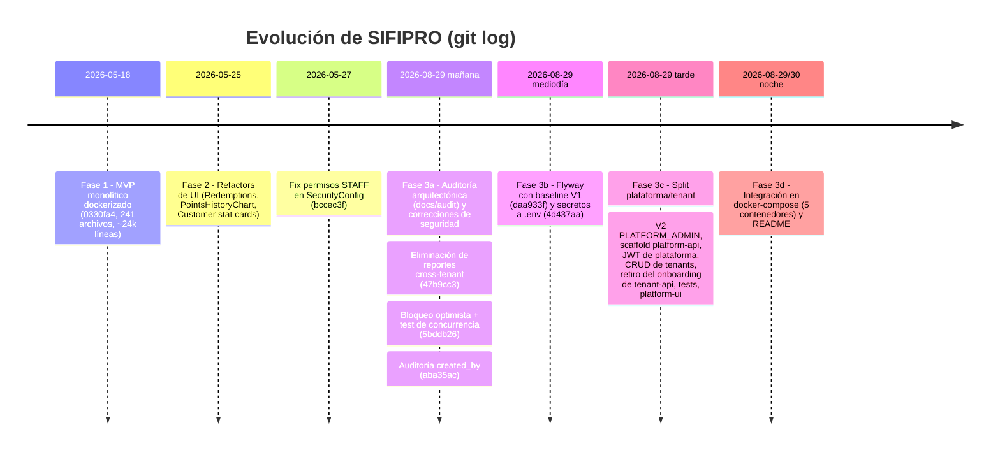
```mermaid
timeline
  title Evolución de SIFIPRO (git log)
  2026-05-18 : Fase 1 - MVP monolítico dockerizado (0330fa4, 241 archivos, ~24k líneas)
  2026-05-25 : Fase 2 - Refactors de UI (Redemptions, PointsHistoryChart, Customer stat cards)
  2026-05-27 : Fix permisos STAFF en SecurityConfig (bccec3f)
  2026-08-29 mañana : Fase 3a - Auditoría arquitectónica (docs/audit) y correcciones de seguridad
             : Eliminación de reportes cross-tenant (47b9cc3)
             : Bloqueo optimista + test de concurrencia (5bddb26)
             : Auditoría created_by (aba35ac)
  2026-08-29 mediodía : Fase 3b - Flyway con baseline V1 (daa933f) y secretos a .env (4d437aa)
  2026-08-29 tarde : Fase 3c - Split plataforma/tenant: V2 PLATFORM_ADMIN, scaffold platform-api, JWT de plataforma, CRUD de tenants, retiro del onboarding de tenant-api, tests, platform-ui
  2026-08-29/30 noche : Fase 3d - Integración en docker-compose (5 contenedores) y README
```

| # | Fecha | Commit | Tipo | Hito | Cambios |
|---|---|---|---|---|---|
| 1 | 05-18 | `0330fa4` | init | Monorepo fullstack dockerizado (backend + frontend + db) | +23 951 |
| 2–6 | 05-25 | `bfd7c3c`, `62c834b`, `8829edf`, `739e4a7`, `ff9bf72` | feature | Refactors de componentes UI (tres commits consecutivos con el mismo mensaje) | ±200 |
| 7 | 05-27 | `bccec3f` | fix | Permisos STAFF en `SecurityConfig` | +19 |
| 8 | 08-29 | `aa93311` | docs | **Auditoría inicial** (`docs/audit/01…05`, 593 líneas) | +593 |
| 9 | 08-29 | `47b9cc3` | fix | Retira `/api/reports/*` (fuga cross-tenant) y fetch muerto | −442 |
| 10 | 08-29 | `5bddb26` | fix | `@Version` + test de concurrencia (anti-sobreventa) | +261 |
| 11 | 08-29 | `aba35ac` | feat | `created_by` en compras, canjes y movimientos | +109 |
| 12 | 08-29 | `daa933f` | feat | **Flyway** activo con baseline V1; `ddl-auto` → `validate` | +624 |
| 13 | 08-29 | `4d437aa` | chore | Secretos a `.env` + `.env.example` | +54/−22 |
| 14 | 08-29 | `ebdd67b` | feat | V2: `tenant_id` nullable + rol `PLATFORM_ADMIN` | +21 |
| 15 | 08-29 | `ccfeff1` | feat | Scaffold `sifipro-platform-api` + health con BD | +688 |
| 16 | 08-29 | `c0fe15b` | feat | JWT de plataforma con enforcement de rol | +828 |
| 17 | 08-29 | `b95a8d2` | feat | Gestión de tenants (crear/listar/activar/desactivar) | +561 |
| 18 | 08-29 | `99c36a2` | refactor | Retira el onboarding de tenant de tenant-api | −150 |
| 19 | 08-29 | `878704d` | test | Tests de integración de tenants y auth de plataforma | +399 |
| 20 | 08-29 | `caf4ed8` | feat | Scaffold `sifipro-platform-ui` con login | +5 774 |
| 21 | 08-29 | `ee3a421` | feat | UI de gestión de tenants | +753 |
| 22 | 08-29 | `e03654a` | feat | platform-api + platform-ui en compose; PLATFORM_ADMIN sembrado | +126 |
| 23–24 | 08-30 | `d0de203`, `06896dd` | docs | README de 4 servicios (dos commits con el mismo mensaje) | ±400 |

**Lectura:** el proyecto nació como un monolito funcional (mayo), tuvo un periodo de pulido visual, y el 29–30 de agosto se ejecutó en ~10 horas un plan de trabajo explícito (`docs/audit/05-plan-de-trabajo.md`) que transformó el monolito en la arquitectura de dos planos. Los timestamps muy próximos entre commits 8–11 (13:54:02 → 13:54:35) indican commits preparados de antemano y aplicados en lote [I].

## C2. Decisiones de arquitectura (mini-ADR)

**ADR-01 — Monorepo con servicios independientes**
- *Contexto:* un solo desarrollador, varias piezas desplegables.
- *Decisión:* un repositorio con 4 subproyectos y un `docker-compose.yml` raíz.
- *Alternativa descartada:* repositorios separados por servicio.
- *Consecuencia:* un solo `docker compose up --build` levanta todo; facilita la defensa; pero favorece copiar código entre proyectos (UI kit y seguridad duplicados).

**ADR-02 — Separar plano de plataforma y plano de tenant, con BD compartida**
- *Contexto:* el monolito no tenía forma de administrar tenants y había expuesto datos entre tenants por accidente (reportes).
- *Decisión:* `platform-api` + `platform-ui` nuevos; `tenant-api` hereda el monolito; ambos usan la misma BD; platform-api solo toca `tenants` y `app_users`.
- *Alternativa descartada:* BD separada para la plataforma o comunicación REST/eventos entre APIs (planteado como decisión abierta en `05-plan-de-trabajo.md` §4).
- *Consecuencia:* alta de tenant atómica y sin integración entre servicios; a cambio, acoplamiento por esquema y entidades duplicadas; platform-api depende de que tenant-api haya migrado primero.

**ADR-03 — Multi-tenancy "shared schema" con filtro manual por `tenant_id`**
- *Contexto:* MVP académico, PostgreSQL único.
- *Decisión:* columna `tenant_id` en todas las tablas y consultas `…AndTenantId` en cada servicio; tenant derivado del usuario autenticado.
- *Alternativas descartadas:* esquema por tenant, BD por tenant, RLS de PostgreSQL, filtros de Hibernate.
- *Consecuencia:* simple y barato; el aislamiento depende de la disciplina (ya falló una vez con reportes); sin red de seguridad central.

**ADR-04 — Autenticación propia con JWT HS512 y un secreto por plano**
- *Contexto:* necesidad de login stateless para SPA.
- *Decisión:* jjwt + Spring Security; `APP_JWT_SECRET` y `PLATFORM_JWT_SECRET` distintos; roles en tabla `app_users`.
- *Alternativa descartada:* Keycloak/OIDC (mencionado como inexistente en `docs/audit/01-infra.md` §3).
- *Consecuencia:* rápido de implementar y verificado en vivo el rechazo cruzado; sin refresh, revocación ni SSO; la separación depende de que los secretos realmente difieran.

**ADR-05 — Usuarios de plataforma en la misma tabla `app_users` con `tenant_id` nulo**
- *Contexto:* había que modelar al operador de plataforma.
- *Decisión:* V2 relaja `tenant_id` y añade el rol `PLATFORM_ADMIN` a `app_users`.
- *Alternativa descartada:* tabla/entidad separada `PlatformOperator` (era la recomendación de `05-plan-de-trabajo.md` §0 y §3).
- *Consecuencia:* migración mínima; pero permitió la **escalada de privilegios** (un ADMIN puede asignar `PLATFORM_ADMIN`) y el email pasa a ser único entre ambos planos.

**ADR-06 — Flyway con baseline tomado de la BD existente; tenant-api único dueño del esquema**
- *Contexto:* el esquema lo generaba Hibernate `ddl-auto=update` y había un script manual "V6".
- *Decisión:* `pg_dump --schema-only` como `V1__baseline_schema.sql`, `baseline-on-migrate`, `ddl-auto=validate`; platform-api con `ddl-auto=none` y Flyway deshabilitado.
- *Alternativa descartada:* seguir con `ddl-auto`, o migraciones en ambos servicios.
- *Consecuencia:* esquema versionado y reproducible; el baseline conserva artefactos de Hibernate (nombres `uk…`/`fk…`, el `UNIQUE(email)` global de clientes).

**ADR-07 — Bloqueo optimista para canjes**
- *Contexto:* condición de carrera documentada (`docs/audit/03-logica.md` §2) que permitía sobreventa.
- *Decisión:* `@Version` en `Customer` y `Reward`; 409 traducido para el usuario.
- *Alternativa descartada:* bloqueo pesimista (`SELECT … FOR UPDATE`) o `UPDATE … WHERE stock > 0`.
- *Consecuencia:* sin bloqueos largos, probado con test; el perdedor debe reintentar manualmente.

**ADR-08 — Eliminar los reportes del servidor y calcularlos en el cliente**
- *Contexto:* `ReportServiceImpl` agregaba datos de todos los tenants.
- *Decisión:* borrar `/api/reports/*` (`47b9cc3`); el frontend ya calculaba sus reportes con endpoints tenant-scoped.
- *Alternativa descartada:* corregir el filtro en el servicio de reportes.
- *Consecuencia:* se cerró la fuga de inmediato; a cambio, los reportes no escalan (descargan todo) y no hay reportes cross-tenant legítimos para la plataforma.

**ADR-09 — nginx como reverse proxy de mismo origen**
- *Contexto:* SPA y API en contenedores distintos.
- *Decisión:* cada UI se sirve con nginx que proxea `/api/` a su API por la red interna.
- *Alternativa descartada:* CORS abierto entre orígenes.
- *Consecuencia:* sin CORS en producción, APIs aislables; en desarrollo tenant-ui aún depende de CORS (sin proxy Vite).

**ADR-10 — Datos semilla en el perfil `dev`**
- *Contexto:* demos repetibles tras `docker compose down -v`.
- *Decisión:* `DevDataSeederConfig` idempotente usando los propios servicios de negocio.
- *Consecuencia:* demo lista al arrancar; como `dev` es el único perfil y el de Docker, las credenciales demo existen en cualquier despliegue.

## C3. Metodología evidenciada

| Práctica | Evidencia | Observación |
|---|---|---|
| Conventional Commits | 19/24 commits con `feat/fix/docs/chore/refactor/test` | 5 usan `feature:`; mensajes duplicados en 3+2 commits |
| Commits atómicos por intención | fase de agosto: un commit por cambio (seguridad, Flyway, secretos, V2, scaffold…) | buena trazabilidad para la defensa |
| Auditoría antes de refactor | `aa93311` (docs/audit) precede a los fixes y al split, y `05-plan-de-trabajo.md` define fases que se siguieron | práctica destacable ("medir antes de cambiar") |
| Tests acompañando fixes | `5bddb26` incluye el test de concurrencia; `878704d` tests de plataforma | sin tests para el resto del dominio |
| Gestión de secretos | `.env.example` + `.gitignore` (`4d437aa`) | secretos antiguos siguen en historial y en `docs/audit` |
| Migraciones versionadas | Flyway V1/V2 | |
| Documentación | README extenso, `docs/audit`, comentarios explicativos en código de platform-api | README con discrepancias (anexo) |
| Ramas / Pull Requests | solo `main`, 0 merges | **No se evidencia** flujo de ramas ni PRs en el historial local |
| Branch protection | — | **No verificable**: `gh` no está instalado y no hay `.github/`; ver supuestos |
| CI/CD | — | No existe |
| Gestión de tareas (issues, tablero) | — | No hay evidencia en el repo |
| Code review | — | No hay evidencia (un solo autor, sin PRs) |

---

# PARTE D — Estado y pendientes

## D1. Semáforo por módulo

✅ completo · 🟡 parcial · ❌ ausente

### Backend (tenant-api + platform-api)

| Módulo | Estado | Motivo |
|---|---|---|
| Autenticación tenant | 🟡 | Login/me funcionan; no revisa tenant activo ni usuario activo en tokens vigentes; sin refresh/revocación; 400 en vez de 401 |
| Autenticación plataforma | 🟡 | Funciona y está probada; acepta PLATFORM_ADMIN con tenant |
| Usuarios internos | 🟡 | CRUD + contraseña; permite asignar PLATFORM_ADMIN y auto-desactivarse |
| Tenants (plataforma) | 🟡 | Alta/lista/activar/desactivar; desactivar sin efecto; sin edición ni métricas |
| Programas de lealtad | ✅ | CRUD + activación con validaciones |
| Clientes | 🟡 | CRUD + perfil 360°; UNIQUE email global contradictorio; sin búsqueda/paginación |
| Recompensas | 🟡 | CRUD + stock; sin gestión de imágenes; stock 0 no desactiva |
| Transacciones / acumulación | ✅ | Fórmula correcta, atómica, auditada con `created_by`; sin anulación |
| Canjes | 🟡 | Validaciones y concurrencia correctas; sin cancelación/reversa; no valida programa activo |
| Ledger de puntos | 🟡 | Trazable; solo 2 de 4 tipos usados; mutable en BD |
| Tiers | 🟡 | Funciona; umbrales fijos, sobre saldo actual |
| Reportes | ❌ | Sin endpoints de servidor (solo cálculo en cliente) |
| Multi-tenancy | ✅ | Filtro consistente, sin fugas activas (mecanismo manual) |
| Manejo de errores | ✅ | Global y uniforme por servicio (inconsistente entre servicios) |
| OpenAPI | 🟡 | Completo en tenant-api (público); ausente en platform-api |
| Migraciones | ✅ | Flyway V1/V2 |
| Pruebas | ❌ | 12 tests de integración dependientes de BD real; sin unitarios; sin CI |
| Auditoría de acciones | 🟡 | `created_by` en 3 tablas; sin log de cambios administrativos |

### Frontend (tenant-ui + platform-ui)

| Pantalla / módulo | Estado | Motivo |
|---|---|---|
| Login (ambas) | ✅ | Estados de carga/error, tema |
| Sesión y guards | 🟡 | Rutas protegidas; sin gating de botones por rol; token en localStorage |
| Dashboard | ✅ | Métricas, gráfica, stock bajo, selector de programa |
| Clientes + perfil | 🟡 | Completo; STAFF ve acciones prohibidas; sin búsqueda/paginación |
| Recompensas | 🟡 | Grid con estados; sin imagen; edición borra imagen; STAFF ve acciones |
| Transacciones | ✅ | Alta + tablas de compras y movimientos |
| Canjes | 🟡 | Alta + historial; lista clientes inactivos; sin cancelación |
| Reportes | 🟡 | Métricas y rankings en cliente; sin fechas ni exportación |
| Usuarios | ✅ | CRUD + contraseña (solo ADMIN/STAFF en UI) |
| Programas | ✅ | CRUD + activación |
| Tenants (platform-ui) | 🟡 | Alta/activar/desactivar; sin detalle, edición, búsqueda ni paginación real |
| Métricas cross-tenant (platform-ui) | ❌ | Anunciado en login, no existe |
| Tests de frontend | ❌ | No hay |
| Calidad (lint) | 🟡 | 19 errores ESLint |

## D2. Lista cruda de faltantes

*(Solo inventario, sin propuesta de solución.)*

**Seguridad y acceso**
1. Restricción de roles asignables por un ADMIN de tenant (`BE/user/service/UserServiceImpl.java:43,84`).
2. Validación `tenant_id IS NULL` para PLATFORM_ADMIN en platform-api (`PA/auth/security/CustomUserDetailsService.java:30`) y en BD.
3. Efecto real de `tenants.active` en login y en cada request del plano tenant (`BE/auth/service/AuthServiceImpl.java:42-68`, `JwtAuthenticationFilter`).
4. Revocación/invalidez de tokens de usuarios desactivados o con contraseña cambiada (`JwtService.isTokenValid`).
5. Refresh token / expiración más corta / logout en servidor.
6. Rate limiting y bloqueo por intentos fallidos en ambos logins.
7. Protección de Swagger y de puertos de debug 8085/8086.
8. Endpoint `/api/platform/health` expone conteo de usuarios.
9. Mensajes de error internos (SQL, `ex.getMessage()`) en respuestas 409/500.
10. Rotación de los secretos que quedaron en historial git y en `docs/audit/01-infra.md`.
11. Cabeceras de seguridad y TLS en nginx.
12. Códigos HTTP coherentes (login fallido 400 vs 401; duplicados 400 vs 409).

**Reglas de negocio**
13. Cancelación / reversa de canjes (estado `CANCELLED` sin flujo).
14. Anulación / devolución de compras.
15. Ajustes manuales de puntos (`ADJUSTMENT`) y expiración (`EXPIRE`).
16. Validación de fechas de compra/canje (futuras o muy antiguas).
17. Validación de programa activo al canjear.
18. Coherencia saldo global vs saldo por programa (dos fuentes de verdad; UI no lo explica).
19. Tiers configurables por tenant/programa y basados en puntos históricos (hoy fijos y sobre saldo).
20. Desactivación automática o aviso al llegar el stock a 0; reposición como operación propia.
21. Guardas: ADMIN no puede desactivarse ni degradarse a sí mismo; debe quedar al menos un ADMIN activo.
22. Programa por defecto al crear un tenant (hoy queda vacío).
23. Límites de canje/anti-fraude.

**Datos**
24. Eliminar `UNIQUE(email)` global de `customers` (`MIG/V1:386-387`) para coincidir con la regla por tenant.
25. CHECKs de BD (stock ≥ 0, saldo ≥ 0, montos > 0), FK de `created_by`, CHECK rol/tenant.
26. Inmutabilidad real del ledger (permisos/triggers) y reconciliación saldo ↔ ledger.
27. Índices por `customer_id` en `points_movements` y `purchase_transactions`.
28. Estrategia de backups.

**API / backend**
29. Swagger/OpenAPI en platform-api.
30. Edición de tenant (nombre), detalle con métricas, listado de usuarios del tenant desde plataforma.
31. Endpoints de reportes tenant-scoped en servidor (con filtros de fecha) y reportes cross-tenant para plataforma.
32. Paginación, búsqueda y filtros en listas de tenant-api.
33. Gestión de operadores de plataforma (hoy solo el sembrado).
34. Auto-servicio "cambiar mi contraseña" y recuperación de contraseña.
35. Log de auditoría de acciones administrativas (quién activó/desactivó/editó qué).
36. Perfil `prod` (sin seeder, sin `show-sql`, con configuración propia).
37. Métodos de repositorio no-scoped a eliminar (riesgo latente).

**Frontend**
38. Ocultar/deshabilitar acciones según rol en Clientes y Recompensas.
39. Campo de imagen en recompensas y no borrar `imageUrl` al editar.
40. Filtrar clientes inactivos en los modales de compra/canje; no ofrecer recompensas inactivas.
41. Corregir textos "Select a program from the header" o mover el selector al header.
42. Pantallas backend sin UI: `GET /api/rewards` (todas), `GET /api/transactions` (todas), `GET /api/transactions/points-movements` (todas), `GET /api/transactions/customer/{id}`, `GET /api/transactions/customer/{id}/points-movements`, `GET /api/platform/tenants/{id}` (sin pantalla de detalle).
43. UI sin backend: "Cross-tenant visibility and metrics" en el login de platform-ui.
44. Uso de `tenant.active` en tenant-ui (aviso de tenant suspendido).
45. Manejo específico de 403 y de expiración de token.
46. Paginación/búsqueda en tablas; paginación real en platform-ui (hoy `size=100` fijo).
47. Paquete compartido para el UI kit duplicado; alinear versiones de dependencias.
48. Corregir los 19 errores de ESLint.
49. Unificar idioma de la interfaz; `<title>` y `lang` del HTML.
50. Variable de build `VITE_API_URL` vs `VITE_API_BASE_URL` en tenant-ui; proxy de Vite en tenant-ui.

**Calidad / proceso**
51. Tests unitarios del dominio (puntos, tiers, canje, validaciones).
52. Tests de aislamiento multi-tenant y de seguridad (roles, tokens cruzados) en tenant-api.
53. Tests de frontend (no hay framework instalado).
54. Tests independientes de la BD de desarrollo (BD efímera) para poder ejecutarlos en CI.
55. Pipeline CI (build, lint, tests) y política de ramas/PRs.
56. Healthchecks de los servicios de aplicación en compose; quitar `version: '3.8'`; usar `${DB_USERNAME}` en el healthcheck.
57. Actualizar `docs/audit/*` (describen un estado anterior) y retirar de ellos los secretos.
58. Corregir el README (ver anexo).

## D3. Riesgos para la defensa

| # | Pregunta probable del evaluador | Respuesta honesta | Dónde está |
|---|---|---|---|
| 1 | "¿Cómo garantizan que un comercio no vea los datos de otro?" | Filtro por `tenant_id` derivado del usuario autenticado en cada consulta; el cliente nunca envía el tenant; revisado endpoint por endpoint. Hubo una fuga en reportes y se eliminó. | B5; `BE/*/service/*ServiceImpl.java` (`findAuthenticatedUser`, `findBy…AndTenantId`); commit `47b9cc3` |
| 2 | "Si desactivo un tenant, ¿sus usuarios quedan fuera?" | **Hoy no.** Es un indicador; login y JWT no lo consultan. | P2; `BE/auth/service/AuthServiceImpl.java:42-68` |
| 3 | "¿Un admin de un comercio puede volverse administrador de la plataforma?" | Por API sí (rol sin filtrar + platform-api no exige tenant nulo). | B6; `UserServiceImpl.java:43`; `PA/.../CustomUserDetailsService.java:30` |
| 4 | "¿Qué pasa si dos cajeros canjean la última unidad al mismo tiempo?" | Bloqueo optimista: uno gana, el otro recibe 409; hay test que lo demuestra. | `Reward.java:19-20`, `Customer.java:18-19`, `RedemptionConcurrencyIntegrationTest` |
| 5 | "¿Por qué su tabla de puntos es un ledger y además guardan el saldo?" | El saldo es caché para lectura rápida y tiers; el ledger da trazabilidad y el saldo por programa para canjear. Ambos se actualizan en la misma transacción. | P11; B8 |
| 6 | "¿El ledger es inmutable?" | Solo por diseño de la aplicación (no hay endpoints de edición); la BD no lo impide. | P11 |
| 7 | "Explique la fórmula de puntos con un ejemplo." | `monto(2 dec) < mínimo ? 0 : monto × ppd (4 dec HALF_UP)`; $80 × 1.5 = 120. | P7; `PurchaseTransactionServiceImpl.java:214-220` |
| 8 | "¿Cómo se calcula el tier y puede bajar?" | Por saldo actual: <500/≥500/≥2000; sí baja al canjear. | P10; `CustomerTier.java` |
| 9 | "¿Por qué dos backends si comparten base de datos?" | Separación de audiencias y de secretos, responsabilidad única; la BD compartida fue una simplificación consciente. | B1; ADR-02 |
| 10 | "¿Cómo sabe el backend a qué tenant pertenece la petición? ¿Usa el claim tenantId?" | Por el usuario en BD (email del `sub`); el claim no se lee. | P3; `JwtService.java:31-36` |
| 11 | "¿Qué pruebas tienen y pasan?" | 12 tests de integración (concurrencia, auth de plataforma, tenants); no hay unitarios, frontend ni CI; requieren BD local. | B11 |
| 12 | "¿Cómo versionan el esquema?" | Flyway, baseline tomado de la BD que había generado Hibernate, luego V2; `ddl-auto=validate`. | B4; `MIG/` |
| 13 | "¿Dónde guardan secretos? ¿Están en git?" | `.env` fuera de git desde `4d437aa`; los antiguos siguen en el historial. | B6 |
| 14 | "¿Qué puede hacer un STAFF?" | Leer todo y crear clientes, compras y canjes; nada de configuración. La UI le muestra algunos botones que el backend rechaza. | A2; `BE/config/SecurityConfig.java:63-88` |
| 15 | "¿Se puede cancelar un canje o una compra?" | No; `CANCELLED` está previsto en el modelo pero sin flujo. | P9; `RedemptionStatus.java` |
| 16 | "¿El mismo cliente puede estar en dos comercios?" | Por diseño debería (regla por tenant), pero la BD tiene un UNIQUE global heredado que lo impide. | P6; `MIG/V1:386-387` |
| 17 | "¿Qué pasa cuando expira el token?" | 24 h; el primer 401 limpia la sesión y redirige al login; no hay refresh. | B9 |
| 18 | "¿Cómo manejan errores?" | `@RestControllerAdvice` con formato `ApiErrorResponse` único; el front extrae `message` y lo muestra en toasts. | `GlobalExceptionHandler` (ambos), `FE/lib/error-utils.ts` |
| 19 | "¿Qué metodología usaron?" | Auditoría → plan por fases → commits atómicos convencionales; un solo desarrollador, sin PRs ni CI. | C1, C3 |
| 20 | "¿Por qué los reportes se calculan en el navegador?" | Se retiraron los del servidor por la fuga cross-tenant; queda pendiente reconstruirlos. | ADR-08; P14 |

---

## Discrepancias README vs código

| # | README dice | El código / sistema muestra | Evidencia |
|---|---|---|---|
| 1 | Índice con "Arquitectura" duplicado (`README.md:16-17`). | Enlace repetido. | `README.md:16-17` |
| 2 | "el JWT de sesión … transporta el identificador del tenant para que todos los servicios filtren automáticamente" (`:58`). | El claim `tenantId` se emite pero nunca se lee; el tenant se obtiene de la BD por el email. | `BE/auth/security/JwtService.java:31-36`; servicios |
| 3 | Desactivar el tenant como "prueba adicional del control de acceso" (`:271-272`); platform-ui dice que sus usuarios "no podrán operar". | No tiene efecto en el login ni en las peticiones del plano tenant. | P2 |
| 4 | "`SPRING_PROFILES_ACTIVE` … solo tenant-api tiene split dev/prod" (`:369`). | Solo existe `application-dev.properties`; no hay perfil `prod`. | `sifipro-backend/src/main/resources/` |
| 5 | `points_movements` "actúa como ledger inmutable" (`:442-443`). | Inmutable solo por convención; sin triggers, con `updated_at`, los tests borran filas. | P11 |
| 6 | ADMIN/STAFF "con `tenant_id` obligatorio" (`:439`). | La BD no lo exige tras V2; nada impide un ADMIN sin tenant ni un PLATFORM_ADMIN con tenant. | `MIG/V2:8-9` |
| 7 | El operador de plataforma no puede entrar a tenant-ui "porque `platform-api` rechaza … cuyo rol no sea PLATFORM_ADMIN" (`:247-250`). | El resultado es correcto pero la razón no: lo impide `tenant-api` al exigir tenant (`AuthServiceImpl.java:62-64`). | [L] 400 "not associated with a tenant" |
| 8 | Configurar `src/.env` con `VITE_API_BASE_URL=http://localhost:8081` para tenant-ui (`:312-313`). | El archivo real está en la raíz del proyecto (`sifipro-frontend/.env`), no en `src/`; en Docker se usa `VITE_API_URL` (nombre que el código no lee). | `FE/lib/api-client.ts:3`; `sifipro-frontend/Dockerfile:17-18` |
| 9 | Tabla de frontends: `VITE_API_URL` para tenant-ui (`:375`). | El código lee `VITE_API_BASE_URL`. | idem |
| 10 | Compose/README: el proxy nginx replica "el proxy de Vite en desarrollo" para tenant-ui (`docker-compose.yml:80-82`). | `sifipro-frontend/vite.config.ts` no define proxy (sí platform-ui). | `sifipro-frontend/vite.config.ts:1-7` |
| 11 | Módulo Clientes: roles "ADMIN, STAFF" (`:409`). | STAFF solo lee y crea; editar/activar/desactivar es solo ADMIN. | `SecurityConfig.java:82-87` |
| 12 | Módulo Transacciones y Canjes: "ADMIN, STAFF" sin matiz; Health check solo `/actuator/health`. | Correcto en roles; además existe `/api/health` y Swagger público no se menciona como riesgo. | `SecurityConfig.java:54-62` |
| 13 | "Ninguna tiene un valor por defecto … si falta alguna, el arranque falla con un error claro" (`:357-359`). | Plausible para backends (placeholders sin default) [I]; en tenant-ui, si falta la variable de Vite no falla: usa rutas relativas. | `api-client.ts:3` |
| 14 | Tecnologías: "React con TypeScript, Vite, Tailwind…" sin versiones; "Spring Boot 4". | Correcto; versiones exactas y drift entre UIs en B2. | B2 |
| 15 | "platform-api … `/me` PLATFORM_ADMIN" y "`platform-api` no expone Swagger". | Correcto [V][L]. | — |
| 16 | "El seeder … solo se ejecuta con el perfil `dev`" | Correcto, pero `dev` es el único perfil y el que usa Docker, por lo que siempre corre. | `DevDataSeederConfig.java:35`; `docker-compose.yml:41` |
| 17 | "Flujo de prueba": el ADMIN nuevo ve "la lista de clientes vacía, sin ningún error" (`:267-269`). | Correcto; pero las pantallas por programa muestran "No program selected" porque no se crea programa por defecto. | P1 |

## Supuestos e incertidumbres

1. **Tests no ejecutados:** no se corrió `./mvnw test` porque las pruebas escriben/borran datos en la BD de desarrollo y necesitan PostgreSQL en `localhost:5432` (no publicado por compose). No se puede afirmar si pasan hoy.
2. **Escalada a PLATFORM_ADMIN y efecto de desactivar tenant:** verificados leyendo el código; no se reprodujeron en vivo para no modificar datos.
3. **Branch protection y PRs en GitHub:** no verificables (sin `gh` CLI ni acceso a la configuración remota); el historial local no muestra merges.
4. **Secretos:** no se leyeron los `.env`; se asume que `APP_JWT_SECRET ≠ PLATFORM_JWT_SECRET` porque el rechazo cruzado funciona en vivo. No se sabe si los secretos antiguos del historial se rotaron.
5. **Visibilidad del repositorio** (público/privado): desconocida; condiciona la gravedad de los secretos en el historial.
6. **Comportamiento con email cambiado** (token con `sub` inexistente): inferido (401 o 500), no probado.
7. **Colisión del `UNIQUE(email)` global de clientes:** inferida del esquema y del handler (409); no se insertó un duplicado para comprobarlo.
8. **Imágenes Docker en ejecución:** creadas hace ~4 semanas; se asume que corresponden al código de `e03654a`/`06896dd` (los commits posteriores solo tocan el README).
9. **`devtools` en el jar:** se asume excluido por el plugin de Spring Boot (comportamiento por defecto).
10. **Carrera en alta de tenants** (500 en vez de 409): inferida; platform-api no maneja `DataIntegrityViolationException`.
11. **Timestamps de commits en lote** interpretados como commits preparados previamente; puede haber otra explicación.
12. **Conteo de filas:** tomado de la BD viva el 2026-09-27 (2 tenants, 4 usuarios, 3 clientes, 1 programa, 3 recompensas, 5 compras, 1 canje, 5 movimientos); cambia con cualquier uso.
13. **Versiones de Spring (Framework, Security, Hibernate, Flyway)** no se listan individualmente: las gestiona el BOM de Spring Boot 4.0.5 y no se resolvió el árbol de dependencias.
